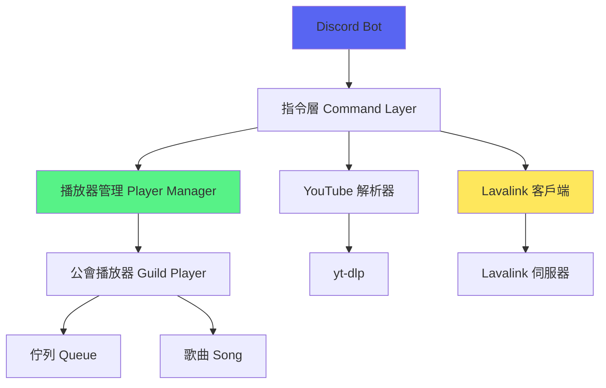

# Discord 音樂機器人 - 索引總覽

> 本索引系統以功能模組分類，以函式為最小單位進行文件化
> 更新時間：2026-06-21

## 🎯 專案概述

這是一個基於 Go 語言開發的 Discord 音樂機器人，整合 Lavalink 音訊服務，支援 YouTube 音樂播放、下載和播放清單管理。

## 📚 文件導航

### 功能模組文件

- [[音樂播放功能]] - YouTube 音樂播放與解析
- [[播放控制功能]] - 暫停、跳過、停止等控制
- [[佇列管理功能]] - FIFO 佇列與歌曲管理
- [[下載功能]] - 多格式音訊下載
- [[播放清單功能]] - 播放清單解析與播放
- [[Lavalink整合]] - Lavalink 音訊服務整合
- [[Bot核心]] - Discord Bot 初始化與生命週期

### 核心流程圖

- [[自動播放下一首流程]] - 完整的自動播放機制

### 知識庫索引

- [[專有名詞索引]] - 技術術語解釋

## 🏗️ 架構概覽

## 📦 核心模組

### 1. Bot 核心 (`internal/bot/`)
- [Bot.New](功能模組/Bot核心.md#New) - Bot 初始化
- [Bot.Start](功能模組/Bot核心.md#Start) - 啟動 Bot
- [事件處理器](功能模組/Lavalink整合.md#事件處理) - Lavalink 事件監聽

### 2. 指令層 (`internal/command/`)
- [Play 指令](功能模組/音樂播放功能.md#Play指令) - 播放音樂
- [Queue 指令](功能模組/佇列管理功能.md#Queue指令) - 查看佇列
- [Skip 指令](功能模組/播放控制功能.md#Skip指令) - 跳過歌曲
- [Pause 指令](功能模組/播放控制功能.md#Pause指令) - 暫停/恢復
- [Stop 指令](功能模組/播放控制功能.md#Stop指令) - 停止播放
- [Loop 指令](功能模組/播放控制功能.md#Loop指令) - 循環播放
- [Download 指令](功能模組/下載功能.md#Download指令) - 下載音訊

### 3. 播放器模組 (`internal/player/`)
- [GuildPlayer](功能模組/佇列管理功能.md#GuildPlayer) - 公會播放器
- [Queue](功能模組/佇列管理功能.md#Queue佇列) - FIFO 佇列實作
- [Song](功能模組/佇列管理功能.md#Song結構) - 歌曲資料結構
- [Manager](功能模組/佇列管理功能.md#Manager管理器) - 播放器管理

### 4. YouTube 模組 (`internal/youtube/`)
- [Resolver](功能模組/音樂播放功能.md#YouTube解析器) - YouTube 解析介面

## 🔍 快速查找

### 按功能查找
- 如何播放音樂？ → [音樂播放功能](功能模組/音樂播放功能.md)
- 如何處理佇列？ → [佇列管理功能](功能模組/佇列管理功能.md)
- 如何自動播放下一首？ → [自動播放下一首流程](流程圖/自動播放下一首流程.md)
- 如何處理播放清單？ → [播放清單功能](功能模組/播放清單功能.md)
- 如何下載音訊？ → [下載功能](功能模組/下載功能.md)

### 按檔案查找
- `internal/command/play.go` → [音樂播放功能](功能模組/音樂播放功能.md)
- `internal/player/player.go` → [佇列管理功能](功能模組/佇列管理功能.md)
- `internal/bot/lavalink_handlers.go` → [Lavalink整合](功能模組/Lavalink整合.md)
- `internal/youtube/resolver.go` → [音樂播放功能](功能模組/音樂播放功能.md)

## 🎨 代碼約定

- **命名規範**：遵循 Go 標準命名規範
- **錯誤處理**：使用 `log.Printf` 記錄錯誤
- **並行安全**：使用 `sync.Mutex` 保護共享資源
- **測試覆蓋**：每個公開函式應有測試

## 📖 相關資源

- [專案開發指南](../CLAUDE.md)
- [專案結構](../STRUCTURE.md)
- [README](../README.md)

---

**開始探索** → 選擇上方任一功能模組開始閱讀
