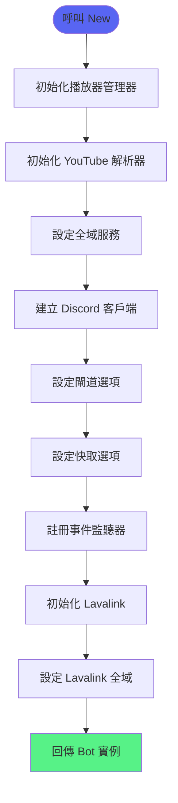
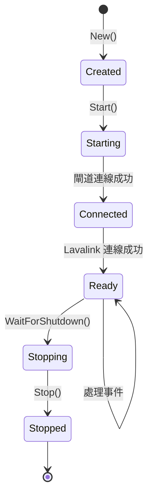

# Bot 核心

> Discord Bot 的初始化與生命週期管理
> 檔案：`internal/bot/bot.go`

## 功能概述

Bot 核心負責：
- Bot 實例初始化
- Discord 閘道連線
- Lavalink 客戶端設定
- 事件處理器註冊
- 指令註冊與管理
- 生命週期控制

## Bot 結構

```go
type Bot struct {
    Client              bot.Client           // Discord 客戶端
    Lavalink            disgolink.Client     // Lavalink 客戶端
    registeredCommands  []snowflake.ID       // 已註冊的指令 ID
    commandHandlers     map[string]command.InteractionHandler  // 指令處理器
    cfg                 *config.Config       // 設定
    playerManager       *player.Manager      // 播放器管理器
}
```

## 初始化流程



## 核心函式

### 1. New - 建立 Bot 實例

**位置**：`internal/bot/bot.go:52`

**功能**：初始化並建立新的 Bot 實例

**程式碼**：
```go
func New(cfg *config.Config) (*Bot, error) {
    // 1. 初始化 player manager（佇列容量 50）
    playerManager := player.NewManager(50)

    // 2. 初始化 YouTube resolver
    youtubeRunner := youtube.NewExecCommandRunner()
    youtubeResolver := youtube.NewResolver(youtubeRunner)

    // 3. 設定全域服務（供指令使用）
    command.SetMusicService(command.NewDefaultMusicService(playerManager))
    command.SetYouTubeResolver(youtubeResolver)

    b := &Bot{
        cfg:           cfg,
        playerManager: playerManager,
    }

    // 4. 建立 disgo client
    client, err := disgo.New(cfg.BotToken,
        bot.WithGatewayConfigOpts(
            gateway.WithIntents(
                gateway.IntentGuilds,
                gateway.IntentGuildVoiceStates,
            ),
            gateway.WithPresenceOpts(
                gateway.WithOnlineStatus(discord.OnlineStatusOnline),
                gateway.WithListeningActivity("音樂 | /help"),
            ),
        ),
        bot.WithCacheConfigOpts(
            cache.WithCaches(
                cache.FlagGuilds,
                cache.FlagVoiceStates,
            ),
        ),
        bot.WithEventListeners(&events.ListenerAdapter{
            OnApplicationCommandInteraction: b.onApplicationCommandInteraction,
            OnComponentInteraction:          b.onComponentInteraction,
            OnModalSubmit:                   b.onModalSubmit,
            OnGuildVoiceStateUpdate:         b.onGuildVoiceStateUpdate,
            OnVoiceServerUpdate:             b.onVoiceServerUpdate,
        }),
    )
    if err != nil {
        return nil, err
    }

    b.Client = client

    // 5. 初始化 Lavalink client
    b.Lavalink = disgolink.New(client.ApplicationID())
    command.SetLavalinkClient(b.Lavalink)

    return b, nil
}
```

**初始化步驟**：
1. 建立播放器管理器（容量 50）
2. 建立 YouTube 解析器
3. 設定全域服務
4. 建立 Discord 客戶端
5. 初始化 Lavalink 客戶端

---

### 2. Start - 啟動 Bot

**位置**：`internal/bot/bot.go:127`

**功能**：啟動 Bot 並連線到 Discord 和 Lavalink

**程式碼**：
```go
func (b *Bot) Start() error {
    ctx := context.Background()

    // 1. 開啟閘道連線
    err := openGateway(ctx, b.Client)
    if err != nil {
        return err
    }

    // 2. 連線到 Lavalink
    log.Printf("[Lavalink] Connecting to Lavalink server...")
    _, err = b.Lavalink.AddNode(ctx, disgolink.NodeConfig{
        Name:     "main",
        Address:  "lavalink:2333",
        Password: "youshallnotpass",
        Secure:   false,
    })
    if err != nil {
        log.Printf("[Lavalink] Failed to connect to Lavalink: %v", err)
        return err
    }
    log.Printf("[Lavalink] Successfully connected to Lavalink")

    // 3. 註冊 Lavalink 事件處理器
    b.Lavalink.AddListeners(&BotEventListener{bot: b})
    log.Printf("[Lavalink] Event handlers registered")

    // 4. 註冊指令
    appID := b.Client.ApplicationID()
    var guildID snowflake.ID
    if b.cfg.GuildID != "" {
        guildID = snowflake.MustParse(b.cfg.GuildID)
    }

    commandIDs, handlers, err := registerBotCommands(b.Client, appID, guildID)
    if err != nil {
        return err
    }

    b.registeredCommands = commandIDs
    b.commandHandlers = handlers

    return nil
}
```

**啟動步驟**：
1. 開啟 Discord 閘道連線
2. 連線到 Lavalink 伺服器
3. 註冊 Lavalink 事件處理器
4. 註冊 Slash Commands

---

### 3. Stop - 停止 Bot

**位置**：`internal/bot/bot.go:172`

**功能**：停止 Bot 並清理指令

**程式碼**：
```go
func (b *Bot) Stop() {
    ctx := context.Background()

    appID := b.Client.ApplicationID()
    var guildID snowflake.ID
    if b.cfg.GuildID != "" {
        guildID = snowflake.MustParse(b.cfg.GuildID)
    }

    // 刪除所有已註冊的指令
    for _, cmdID := range b.registeredCommands {
        if err := deleteGuildCommand(ctx, b.Client, appID, guildID, cmdID); err != nil {
            log.Printf("failed to delete command %d: %v", cmdID, err)
        }
    }

    // 關閉閘道連線
    closeGateway(ctx, b.Client)
}
```

---

### 4. WaitForShutdown - 等待中斷訊號

**位置**：`internal/bot/bot.go:191`

**功能**：阻塞等待 SIGINT 或 SIGTERM 訊號

**程式碼**：
```go
func (b *Bot) WaitForShutdown() {
    stop := make(chan os.Signal, 1)
    notifyShutdownSignal(stop)
    <-stop
}
```

---

## 事件處理

### 1. onApplicationCommandInteraction

**位置**：`internal/bot/bot.go:198`

**功能**：處理應用程式指令互動事件

```go
func (b *Bot) onApplicationCommandInteraction(event *events.ApplicationCommandInteractionCreate) {
    name := event.Data.CommandName()
    if handler, ok := b.commandHandlers[name]; ok {
        handler(event)
    }
}
```

---

### 2. onComponentInteraction

**位置**：`internal/bot/bot.go:206`

**功能**：處理按鈕和選單等元件互動事件

```go
func (b *Bot) onComponentInteraction(event *events.ComponentInteractionCreate) {
    command.HandleControlPanelInteraction(event)
}
```

---

### 3. onModalSubmit

**位置**：`internal/bot/bot.go:211`

**功能**：處理 Modal 提交事件

```go
func (b *Bot) onModalSubmit(event *events.ModalSubmitInteractionCreate) {
    command.HandleModalSubmit(event)
}
```

---

## 閘道設定

### Intents（意圖）

```go
gateway.WithIntents(
    gateway.IntentGuilds,           // 伺服器事件
    gateway.IntentGuildVoiceStates, // 語音狀態事件
)
```

**必要的 Intents**：
- `Guilds` - 基本伺服器資訊
- `GuildVoiceStates` - 語音頻道狀態（必須，用於音樂功能）

---

### Presence（狀態）

```go
gateway.WithPresenceOpts(
    gateway.WithOnlineStatus(discord.OnlineStatusOnline),
    gateway.WithListeningActivity("音樂 | /help"),
)
```

**顯示效果**：
```
🟢 Bot名稱
   正在聆聽 音樂 | /help
```

---

### Cache（快取）

```go
cache.WithCaches(
    cache.FlagGuilds,       // 快取伺服器資訊
    cache.FlagVoiceStates,  // 快取語音狀態
)
```

**快取目的**：
- 減少 API 呼叫
- 提高回應速度
- 降低延遲

---

## 生命週期



---

## 設定管理

### Config 結構

**位置**：`internal/config/config.go`

```go
type Config struct {
    BotToken string // Discord Bot Token
    GuildID  string // 測試伺服器 ID（可選）
}
```

### 載入設定

```go
cfg := &config.Config{
    BotToken: os.Getenv("BOT_TOKEN"),
    GuildID:  os.Getenv("GUILD_ID"),
}
```

**環境變數**：
- `BOT_TOKEN` - Discord Bot Token（必要）
- `GUILD_ID` - 測試伺服器 ID（可選，用於快速測試）

---

## 錯誤處理

| 錯誤 | 原因 | 處理方式 |
|------|------|---------|
| 無效的 Token | BOT_TOKEN 錯誤 | 檢查環境變數 |
| 閘道連線失敗 | 網路問題 | 檢查網路連線 |
| Lavalink 連線失敗 | Lavalink 未啟動 | 啟動 Lavalink 伺服器 |
| 指令註冊失敗 | 權限不足 | 檢查 Bot 權限 |

---

## 主程式

**位置**：`cmd/bot/main.go`

```go
func main() {
    // 1. 載入設定
    cfg := &config.Config{
        BotToken: os.Getenv("BOT_TOKEN"),
        GuildID:  os.Getenv("GUILD_ID"),
    }

    // 2. 建立 Bot
    b, err := bot.New(cfg)
    if err != nil {
        log.Fatalf("Failed to create bot: %v", err)
    }

    // 3. 啟動 Bot
    if err := b.Start(); err != nil {
        log.Fatalf("Failed to start bot: %v", err)
    }

    log.Println("Bot is running. Press CTRL+C to exit.")

    // 4. 等待中斷訊號
    b.WaitForShutdown()

    log.Println("Shutting down...")

    // 5. 停止 Bot
    b.Stop()
}
```

---

## 相關文件

- [Lavalink整合](Lavalink整合.md) - Lavalink 客戶端
- [音樂播放功能](音樂播放功能.md) - 指令處理
- [專有名詞索引](../知識庫/專有名詞索引.md) - 技術術語

---

## 測試覆蓋

- `bot_test.go` - Bot 核心測試
- 測試場景：
  - ✅ Bot 初始化
  - ✅ 閘道連線
  - ✅ 事件處理
  - ✅ 指令註冊
  - ✅ 生命週期管理
