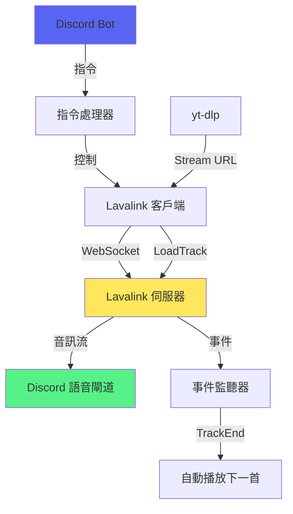
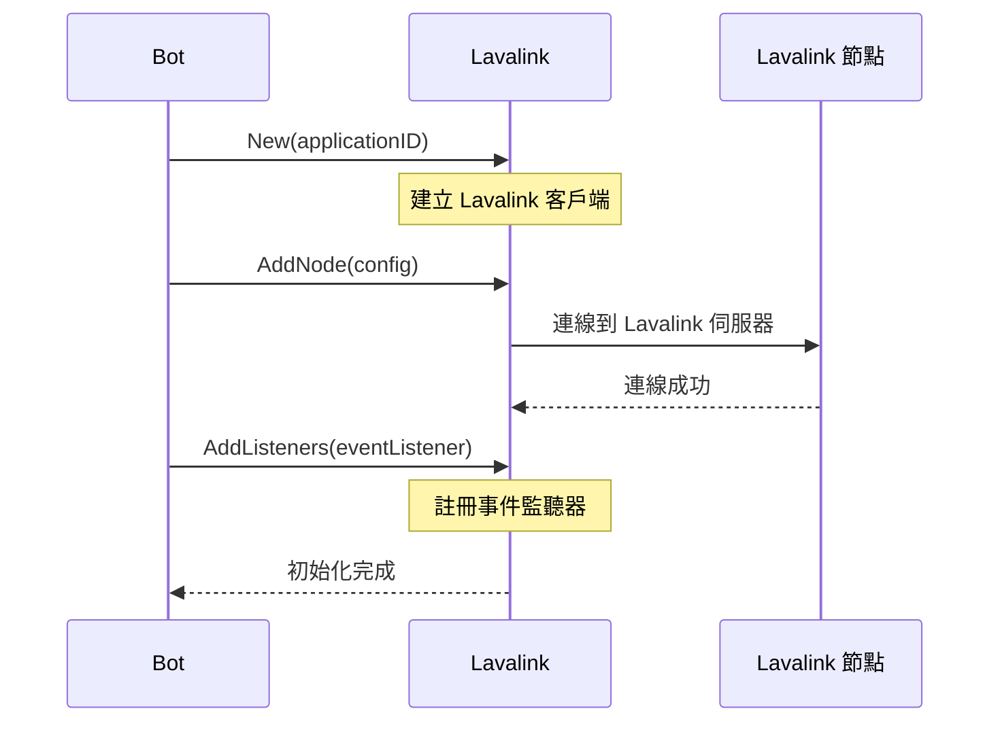
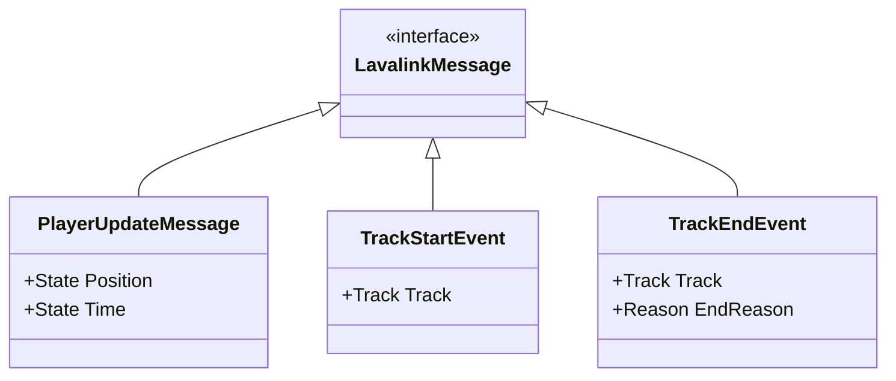
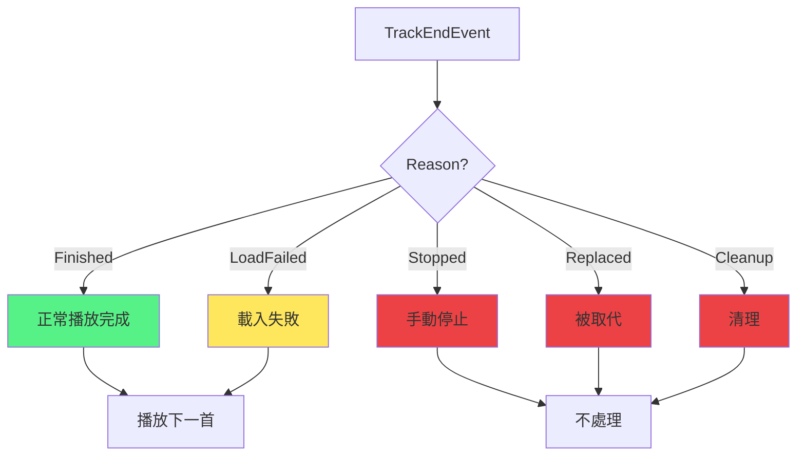
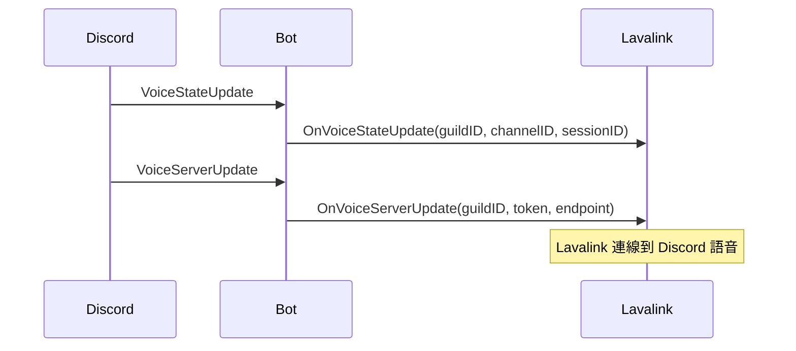

# Lavalink 整合

> Lavalink 音訊服務整合與事件處理
> 檔案：`internal/bot/lavalink_handlers.go`, `internal/command/lavalink.go`

## 功能概述

Lavalink 是獨立的音訊播放伺服器，負責：
- 音訊流解碼
- 音訊播放控制
- 負載平衡
- 音訊過濾器

## 架構圖



## 初始化流程



## 初始化程式碼

**位置**：`internal/bot/bot.go:116`

```go
// 初始化 Lavalink client
log.Printf("[Lavalink] Initializing Lavalink client...")
b.Lavalink = disgolink.New(client.ApplicationID())

// 設定全域服務（供指令使用）
command.SetLavalinkClient(b.Lavalink)

// 連線到 Lavalink
log.Printf("[Lavalink] Connecting to Lavalink server...")
_, err = b.Lavalink.AddNode(ctx, disgolink.NodeConfig{
    Name:     "main",
    Address:  "lavalink:2333",
    Password: "youshallnotpass",
    Secure:   false,
})

// 註冊 Lavalink 事件處理器
b.Lavalink.AddListeners(&BotEventListener{bot: b})
```

## 設定參數

| 參數 | 值 | 說明 |
|------|----|----|
| Name | "main" | 節點名稱 |
| Address | "lavalink:2333" | Lavalink 伺服器位址 |
| Password | "youshallnotpass" | 連線密碼 |
| Secure | false | 是否使用 WSS（WebSocket Secure） |

## 事件處理

### BotEventListener

**位置**：`internal/bot/lavalink_handlers.go:13`

**實作 `disgolink.EventListener` 介面**：

```go
type BotEventListener struct {
    bot *Bot
}

func (l *BotEventListener) OnEvent(player disgolink.Player, event lavalink.Message) {
    switch e := event.(type) {
    case lavalink.PlayerUpdateMessage:
        l.bot.onPlayerUpdate(player, e)
    case lavalink.TrackStartEvent:
        l.bot.onTrackStart(player, e)
    case lavalink.TrackEndEvent:
        l.bot.onTrackEnd(player, e)
    }
}
```

### 事件類型



### 1. onPlayerUpdate

**位置**：`internal/bot/lavalink_handlers.go:30`

**功能**：處理播放器狀態更新

```go
func (b *Bot) onPlayerUpdate(player disgolink.Player, event lavalink.PlayerUpdateMessage) {
    log.Printf("[Lavalink] Player update for guild %d: position=%d", 
        player.GuildID(), event.State.Position)
}
```

**觸發時機**：定期更新（約每 5 秒）

---

### 2. onTrackStart

**位置**：`internal/bot/lavalink_handlers.go:34`

**功能**：音軌開始播放時觸發

```go
func (b *Bot) onTrackStart(player disgolink.Player, event lavalink.TrackStartEvent) {
    log.Printf("[Lavalink] Track started for guild %d: %s", 
        player.GuildID(), event.Track.Info.Title)
}
```

---

### 3. onTrackEnd

**位置**：`internal/bot/lavalink_handlers.go:39`

**功能**：音軌結束時自動播放下一首

```go
func (b *Bot) onTrackEnd(player disgolink.Player, event lavalink.TrackEndEvent) {
    log.Printf("[Lavalink] Track ended for guild %d: %s (reason: %s)", 
        player.GuildID(), event.Track.Info.Title, event.Reason)

    // 處理正常結束或載入失敗的情況
    shouldPlayNext := event.Reason == lavalink.TrackEndReasonFinished || 
                      event.Reason == lavalink.TrackEndReasonLoadFailed

    if !shouldPlayNext {
        return
    }

    if event.Reason == lavalink.TrackEndReasonLoadFailed {
        log.Printf("[Lavalink] Track failed to load, skipping to next song...")
    }

    b.playNextSongInQueue(player)
}
```

#### TrackEndReason 類型



| Reason | 說明 | 自動播放下一首 |
|--------|------|--------------|
| Finished | 正常播放完成 | ✅ |
| LoadFailed | 無法載入/播放 | ✅ |
| Stopped | 手動停止（/stop） | ❌ |
| Replaced | 被新音軌取代 | ❌ |
| Cleanup | 清理（Bot 斷線） | ❌ |

---

## 播放控制操作

### LoadTrack - 載入音軌

**位置**：`internal/command/voice.go:38`

```go
node := lavalinkClient.BestNode()
node.LoadTracksHandler(ctx, trackURL, disgolink.NewResultHandler(
    func(track lavalink.Track) {
        // 單個音軌
        loadedTrack = track
    },
    func(playlist lavalink.Playlist) {
        // 播放清單
        if len(playlist.Tracks) > 0 {
            loadedTrack = playlist.Tracks[0]
        }
    },
    func(tracks []lavalink.Track) {
        // 搜尋結果
        if len(tracks) > 0 {
            loadedTrack = tracks[0]
        }
    },
    func() {
        // 無匹配
        loadErr = fmt.Errorf("no matches found")
    },
    func(err error) {
        // 載入失敗
        loadErr = err
    },
))
```

### PlayTrack - 播放音軌

```go
player := lavalinkClient.Player(guildID)
err = player.Update(ctx, lavalink.WithTrack(loadedTrack))
```

### PauseTrack - 暫停/恢復

```go
player := lavalinkClient.Player(guildID)
err = player.Update(ctx, lavalink.WithPaused(true))  // 暫停
err = player.Update(ctx, lavalink.WithPaused(false)) // 恢復
```

### StopTrack - 停止播放

```go
player := lavalinkClient.Player(guildID)
err = player.Update(ctx, lavalink.WithNullTrack())
```

---

## 語音狀態同步

### Discord 語音事件

Bot 需要監聽並轉發語音事件給 Lavalink：



### 程式碼實作

**位置**：`internal/bot/bot.go:91`

```go
bot.WithEventListeners(&events.ListenerAdapter{
    OnGuildVoiceStateUpdate: func(event *events.GuildVoiceStateUpdate) {
        if b.Lavalink != nil && event.VoiceState.UserID == b.Client.ApplicationID() {
            // 只處理 bot 自己的 voice state 變更
            b.Lavalink.OnVoiceStateUpdate(
                context.Background(), 
                event.VoiceState.GuildID, 
                event.VoiceState.ChannelID, 
                event.VoiceState.SessionID,
            )
        }
    },
    OnVoiceServerUpdate: func(event *events.VoiceServerUpdate) {
        if b.Lavalink != nil && event.Endpoint != nil {
            b.Lavalink.OnVoiceServerUpdate(
                context.Background(), 
                event.GuildID, 
                event.Token, 
                *event.Endpoint,
            )
        }
    },
})
```

---

## 錯誤處理

### 常見錯誤

| 錯誤 | 原因 | 解決方案 |
|------|------|---------|
| no lavalink nodes available | Lavalink 未連線 | 檢查 Lavalink 伺服器狀態 |
| no matches found | 無法載入音軌 | 檢查 URL 是否有效 |
| failed to play track | 播放失敗 | 使用備用源（SoundCloud） |
| voice connection timeout | 語音連線逾時 | 重試連線 |

---

## Docker 設定

### docker-compose.yml

```yaml
services:
  lavalink:
    image: ghcr.io/lavalink-devs/lavalink:4.0.8
    ports:
      - "2333:2333"
    environment:
      - SERVER_PORT=2333
      - LAVALINK_SERVER_PASSWORD=youshallnotpass
    volumes:
      - ./lavalink/application.yml:/opt/Lavalink/application.yml
```

---

## 相關文件

- [音樂播放功能](音樂播放功能.md) - 播放功能
- [播放控制功能](播放控制功能.md) - 控制操作
- [專有名詞索引](../知識庫/專有名詞索引.md) - Lavalink 術語

---

## 參考資源

- [Lavalink 官方文件](https://lavalink.dev/)
- [disgolink GitHub](https://github.com/disgoorg/disgolink)
