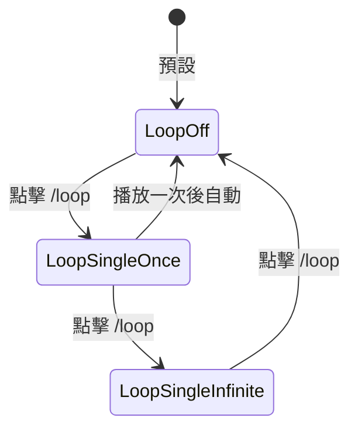
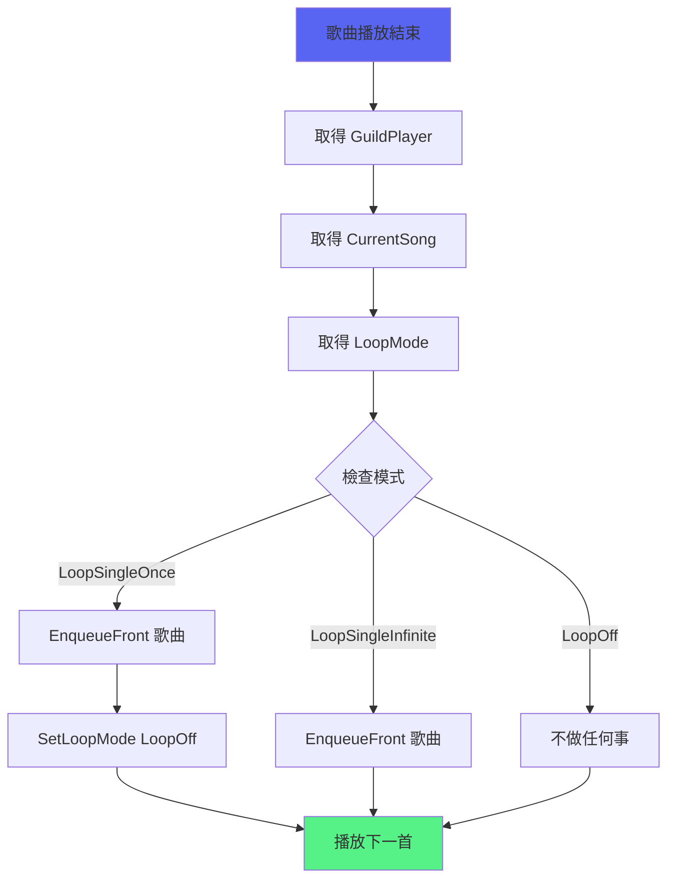

# Loop 循環播放功能

> 單曲循環播放功能，支援循環一次和無限循環
> 檔案：`internal/command/loop.go`, `internal/player/loop.go`, `internal/bot/lavalink_handlers.go`

## 功能概述

Loop 功能提供三種循環模式：
- 🔁 **關閉**（預設）- 正常播放，不循環
- 🔂 **單曲循環一次** - 當前歌曲播放完後重複一次，然後自動關閉
- 🔁 **單曲無限循環** - 當前歌曲無限循環播放

## 循環模式切換



## 核心資料結構

### LoopMode 類型

**位置**：`internal/player/loop.go:4`

**定義**：
```go
type LoopMode int

const (
    LoopOff LoopMode = iota            // 關閉循環
    LoopSingleOnce                      // 單曲循環一次
    LoopSingleInfinite                  // 單曲無限循環
)
```

**方法**：

#### String()
```go
func (m LoopMode) String() string
```
回傳循環模式的字串表示。

**回傳值**：
- `"關閉"` - LoopOff
- `"單曲循環一次"` - LoopSingleOnce  
- `"單曲無限循環"` - LoopSingleInfinite

#### Icon()
```go
func (m LoopMode) Icon() string
```
回傳循環模式的圖示。

**回傳值**：
- `"🔁"` - LoopOff
- `"🔂"` - LoopSingleOnce
- `"🔁"` - LoopSingleInfinite

#### ButtonStyle()
```go
func (m LoopMode) ButtonStyle() int
```
回傳控制面板按鈕的樣式。

**回傳值**：
- `2` (Secondary/灰色) - LoopOff
- `1` (Primary/藍色) - LoopSingleOnce
- `3` (Success/綠色) - LoopSingleInfinite

**視覺層次**：灰色 → 藍色 → 綠色（遞增的循環強度）

## GuildPlayer 循環方法

### GetLoopMode()

**位置**：`internal/player/player.go`

**功能**：取得當前的循環播放模式

**簽名**：
```go
func (p *GuildPlayer) GetLoopMode() LoopMode
```

**回傳**：當前的 LoopMode

**執行緒安全**：是（使用 RLock）

### SetLoopMode()

**位置**：`internal/player/player.go`

**功能**：設定循環播放模式

**簽名**：
```go
func (p *GuildPlayer) SetLoopMode(mode LoopMode)
```

**參數**：
- `mode`: 要設定的循環模式

**執行緒安全**：是（使用 Lock）

### ToggleLoopMode()

**位置**：`internal/player/player.go`

**功能**：切換循環播放模式

**簽名**：
```go
func (p *GuildPlayer) ToggleLoopMode() LoopMode
```

**回傳**：切換後的新模式

**切換順序**：
```
LoopOff → LoopSingleOnce → LoopSingleInfinite → LoopOff
```

**執行緒安全**：是（使用 Lock）

## 循環邏輯實作

### handleLoopMode()

**位置**：`internal/bot/lavalink_handlers.go:112`

**功能**：在歌曲結束時處理循環邏輯

**呼叫時機**：`onTrackEnd` 事件中，在播放下一首之前

**處理流程**：



**程式碼**：
```go
func (b *Bot) handleLoopMode(player disgolink.Player) {
    guildPlayer, _ := b.playerManager.Get(player.GuildID().String())
    currentSong, hasSong := guildPlayer.CurrentSong()
    if !hasSong {
        return
    }

    loopMode := guildPlayer.GetLoopMode()

    switch loopMode {
    case LoopSingleOnce:
        // 插入到佇列最前面，然後關閉循環
        guildPlayer.EnqueueFront(currentSong)
        guildPlayer.SetLoopMode(LoopOff)
        
    case LoopSingleInfinite:
        // 插入到佇列最前面
        guildPlayer.EnqueueFront(currentSong)
        
    case LoopOff:
        // 不循環
    }
}
```

## EnqueueFront() - 前端插入

**位置**：`internal/player/queue.go:79`

**功能**：將歌曲插入到佇列最前面（用於循環）

**簽名**：
```go
func (q *Queue) EnqueueFront(song Song) error
```

**實作**：
```go
func (q *Queue) EnqueueFront(song Song) error {
    q.mu.Lock()
    defer q.mu.Unlock()

    if len(q.songs) >= q.capacity {
        return ErrQueueFull
    }

    // 在最前面插入歌曲
    q.songs = append([]Song{song}, q.songs...)
    return nil
}
```

**為什麼需要 EnqueueFront？**

如果使用普通的 `Enqueue`（加到最後），會導致錯誤的播放順序：

```
錯誤順序（使用 Enqueue）：
A（播放中）→ 佇列 [B, C]
A 結束 → Enqueue(A) → 佇列 [B, C, A]
播放順序：A → B → C → A ❌

正確順序（使用 EnqueueFront）：
A（播放中）→ 佇列 [B, C]
A 結束 → EnqueueFront(A) → 佇列 [A, B, C]
播放順序：A → A → B → C ✅
```

## 使用範例

### 範例 1：單曲循環一次

```
1. 播放歌曲 A
2. 加入歌曲 B 到佇列
3. 執行 /loop（切換到單曲循環一次）
4. 歌曲 A 播放完畢
5. handleLoopMode() 將 A 插入佇列最前面
6. 自動關閉循環模式
7. 播放順序：A → A（重複一次）→ B
```

### 範例 2：單曲無限循環

```
1. 播放歌曲 A
2. 加入歌曲 B 到佇列  
3. 執行 /loop 兩次（切換到單曲無限循環）
4. 歌曲 A 播放完畢
5. handleLoopMode() 將 A 插入佇列最前面
6. 循環模式保持開啟
7. 播放順序：A → A → A → A → ...（無限循環）
```

### 範例 3：控制面板使用

```
1. 播放歌曲
2. 點擊「顯示控制面板」按鈕
3. 點擊循環按鈕（藍底 🔁）
4. 按鈕變成綠底 🔂（單曲循環一次）
5. 再次點擊，變成綠底 🔁（無限循環）
6. 再次點擊，變回藍底 🔁（關閉）
```

## 按鈕顏色和圖示

| 模式 | 顏色 | 圖示 | 說明 |
|------|------|------|------|
| LoopOff | 灰色 (Secondary) | 🔁 | 關閉循環 |
| LoopSingleOnce | 藍色 (Primary) | 🔂 | 單曲循環一次 |
| LoopSingleInfinite | 綠色 (Success) | 🔁 | 單曲無限循環 |

**視覺層次**：灰色 → 藍色 → 綠色

## 測試

**位置**：`internal/player/loop_test.go`, `internal/command/loop_test.go`

**測試覆蓋**：
- ✅ 預設模式為 LoopOff
- ✅ 設定和取得循環模式
- ✅ 切換循環模式順序
- ✅ 並行安全性
- ✅ 停止後重置模式
- ✅ 字串表示和圖示
- ✅ 按鈕樣式
- ✅ 指令定義
- ✅ 整合測試

## 相關文件

- [播放控制功能](播放控制功能.md) - 所有播放控制指令
- [佇列管理功能](佇列管理功能.md) - 佇列操作
- [Lavalink整合](Lavalink整合.md) - 事件處理
