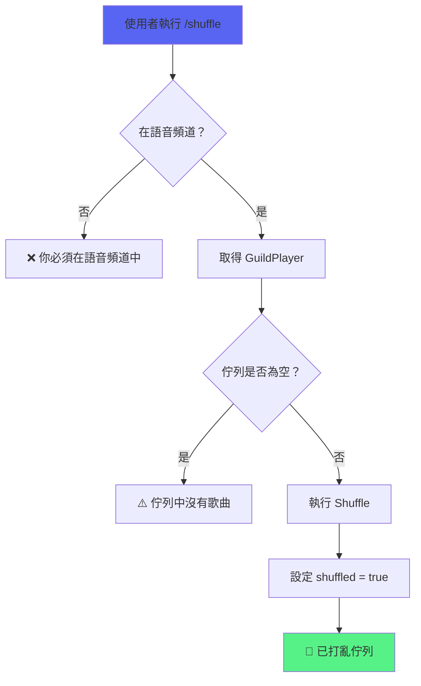

# Shuffle 隨機播放功能

> 隨機打亂佇列中的歌曲順序
> 檔案：`internal/command/shuffle.go`, `internal/player/queue.go`, `internal/command/control_panel.go`

## 功能概述

Shuffle 功能提供隨機播放功能：
- 🔀 打亂佇列中的歌曲順序
- 不影響當前正在播放的歌曲
- 按鈕顏色顯示是否已打亂
- 使用 Fisher-Yates 演算法確保真隨機

## 使用方式

### 1. 斜線指令

```
/shuffle
```

打亂佇列中的所有歌曲順序。

### 2. 控制面板按鈕

點擊控制面板第一行最右邊的 🔀 按鈕。

## 核心實作

### Queue.Shuffle() - 佇列打亂

**位置**：`internal/player/queue.go:95`

**功能**：使用 Fisher-Yates 演算法打亂佇列中的歌曲

**簽名**：
```go
func (q *Queue) Shuffle()
```

**實作**：
```go
func (q *Queue) Shuffle() {
	q.mu.Lock()
	defer q.mu.Unlock()

	// 使用 Fisher-Yates shuffle 算法
	for i := len(q.songs) - 1; i > 0; i-- {
		j := rand.Intn(i + 1)
		q.songs[i], q.songs[j] = q.songs[j], q.songs[i]
	}
}
```

**特點**：
- 執行緒安全（使用 mutex）
- O(n) 時間複雜度
- 真隨機分佈
- 不會修改佇列長度

### GuildPlayer Shuffle 方法

**位置**：`internal/player/player.go`

#### Shuffle()
```go
func (p *GuildPlayer) Shuffle()
```

打亂佇列並設定 `shuffled` 狀態為 true。

#### IsShuffled()
```go
func (p *GuildPlayer) IsShuffled() bool
```

檢查佇列是否已被打亂。

#### SetShuffled()
```go
func (p *GuildPlayer) SetShuffled(shuffled bool)
```

設定打亂狀態。

**狀態管理**：
- `shuffled` 欄位記錄是否已打亂
- `Stop()` 時自動重置為 false
- 執行緒安全（使用 RWMutex）

## 指令實作

### shuffleCommandHandler

**位置**：`internal/command/shuffle.go:21`

**功能**：處理 /shuffle 指令

**流程**：


**程式碼**：
```go
func shuffleCommandHandler(event *events.ApplicationCommandInteractionCreate) {
	// 檢查使用者是否在語音頻道
	guildID, _, ok := getVoiceContext(event)
	if !ok {
		updateResponse(event, "❌ 你必須在語音頻道中才能使用此指令")
		return
	}

	// 取得播放器
	guildPlayer := musicService.GetOrCreatePlayer(guildID.String())

	// 檢查佇列是否為空
	queueLen := guildPlayer.QueueLen()
	if queueLen == 0 {
		updateResponse(event, "⚠️ 佇列中沒有歌曲可以打亂")
		return
	}

	// 打亂佇列
	guildPlayer.Shuffle()

	// 回應使用者
	message := fmt.Sprintf("🔀 **已打亂佇列**\n共 %d 首歌曲已隨機排序", queueLen)
	event.CreateMessage(discord.MessageCreate{Content: message})
}
```

## 控制面板整合

### 按鈕位置

**第一行**：⏯️ ⏭️ ⏹️ 🔁 🔀  
（暫停、跳過、停止、循環、**隨機**）

**第二行**：🔍 搜尋 | 🎵 當前播放 | 📜 播放佇列

### 按鈕狀態

| 狀態 | 顏色 | 圖示 | 說明 |
|------|------|------|------|
| 未打亂 | 灰色 (Secondary) | 🔀 | 佇列保持原始順序 |
| 已打亂 | 綠色 (Success) | 🔀 | 佇列已被打亂 |

### 按鈕實作

**位置**：`internal/command/control_panel.go:128`

```go
discord.ButtonComponent{
	Style:    getShuffleButtonStyle(player),
	CustomID: ButtonShuffle,
	Emoji:    &discord.ComponentEmoji{Name: "🔀"},
}
```

### 處理函數

**位置**：`internal/command/control_panel.go:331`

```go
func handleShuffleButton(event *events.ComponentInteractionCreate, player PlayerController) {
	// 檢查佇列是否為空
	queueLen := player.QueueLen()
	if queueLen == 0 {
		respondToComponentInteraction(event, "⚠️ 佇列中沒有歌曲可以打亂")
		return
	}

	// 打亂佇列
	player.Shuffle()

	// 回應訊息
	message := fmt.Sprintf("🔀 **已打亂佇列**\n共 %d 首歌曲已隨機排序", queueLen)
	respondToComponentInteraction(event, message)
}
```

### 按鈕樣式函數

```go
func getShuffleButtonStyle(player PlayerController) discord.ButtonStyle {
	if player.IsShuffled() {
		return discord.ButtonStyleSuccess // 綠色
	}
	return discord.ButtonStyleSecondary // 灰色
}
```

## Fisher-Yates 演算法

### 原理

Fisher-Yates shuffle 是一個生成隨機排列的演算法，保證每個排列出現的機率相等。

**時間複雜度**：O(n)  
**空間複雜度**：O(1)（原地操作）

### 演算法步驟

```
初始陣列：[A, B, C, D, E]

i=4: 從 [0,4] 隨機選 j=2，交換 songs[4] ↔ songs[2]
     → [A, B, E, D, C]

i=3: 從 [0,3] 隨機選 j=0，交換 songs[3] ↔ songs[0]
     → [D, B, E, A, C]

i=2: 從 [0,2] 隨機選 j=1，交換 songs[2] ↔ songs[1]
     → [D, E, B, A, C]

i=1: 從 [0,1] 隨機選 j=0，交換 songs[1] ↔ songs[0]
     → [E, D, B, A, C]

結果：[E, D, B, A, C]
```

## 使用範例

### 範例 1：基本使用

```
佇列狀態：A（播放中）, [B, C, D, E]

執行 /shuffle：
- 當前播放：A（不變）
- 佇列打亂：[D, B, E, C]
- 播放順序：A → D → B → E → C
```

### 範例 2：空佇列

```
佇列狀態：A（播放中）, []

執行 /shuffle：
⚠️ 佇列中沒有歌曲可以打亂
```

### 範例 3：控制面板使用

```
1. 點擊「顯示控制面板」
2. 看到 🔀 按鈕（灰底）
3. 點擊 🔀 按鈕
4. 按鈕變成綠底 🔀
5. 收到訊息：🔀 **已打亂佇列** 共 5 首歌曲已隨機排序
```

## 測試

**位置**：`internal/player/queue_test.go`

### TestQueue_Shuffle

測試基本打亂功能：
- 佇列長度不變
- 所有歌曲都還在
- 順序改變

### TestQueue_ShuffleEmpty

測試空佇列打亂：
- 不應該 panic
- 佇列仍為空

### TestQueue_ShuffleSingleSong

測試單首歌曲：
- 歌曲不變
- 不應該出錯

### TestQueue_ShuffleConcurrent

測試並行安全：
- 多個 goroutine 同時打亂
- 不應該 race condition
- 佇列長度正確

## 與其他功能的整合

### 與 Loop 功能

- Shuffle 不影響 Loop 模式
- 循環播放會按打亂後的順序循環
- 可以先 shuffle 再設定 loop

**範例**：
```
1. 佇列：[A, B, C, D]
2. Shuffle → [C, A, D, B]
3. 設定無限循環
4. 播放順序：C → A → D → B → C → A → D → B → ...
```

### 與 Play 功能

- 新加入的歌曲會加到佇列末端
- 不會自動重新打亂
- 如需重新打亂，需再次執行 shuffle

### 與 Stop 功能

- Stop 時 `shuffled` 狀態重置為 false
- 重新播放時需要再次 shuffle

### 與 Queue 功能

- `/queue` 顯示打亂後的順序
- 顯示的就是實際播放順序

## 狀態管理

### shuffled 欄位

```go
type GuildPlayer struct {
	// ...
	shuffled bool // 是否已打亂佇列
}
```

**狀態轉換**：
```
初始：shuffled = false（未打亂）
執行 Shuffle()：shuffled = true（已打亂）
執行 Stop()：shuffled = false（重置）
```

**用途**：
- 控制按鈕顏色
- 追蹤佇列狀態
- UI 反饋

## 技術細節

### 執行緒安全

所有佇列操作都使用 `sync.Mutex` 保護：

```go
func (q *Queue) Shuffle() {
	q.mu.Lock()         // 鎖定
	defer q.mu.Unlock() // 解鎖

	// ... 打亂邏輯
}
```

### 隨機數生成

使用 `math/rand` 套件：

```go
import "math/rand"

// 在 Fisher-Yates 中
j := rand.Intn(i + 1)
```

**注意**：`math/rand` 需要在程式啟動時設定 seed。

### 效能

- **時間複雜度**：O(n) - 線性時間
- **空間複雜度**：O(1) - 原地操作
- **執行緒安全**：使用 mutex 保護
- **記憶體開銷**：無額外分配

## UI/UX 設計

### 回應訊息

**成功**：
```
🔀 **已打亂佇列**
共 5 首歌曲已隨機排序
```

**錯誤 - 空佇列**：
```
⚠️ 佇列中沒有歌曲可以打亂
```

**錯誤 - 不在語音頻道**：
```
❌ 你必須在語音頻道中才能使用此指令
```

### 按鈕設計

- **只顯示圖示**：🔀（不顯示文字）
- **顏色狀態**：灰色/綠色區分
- **位置**：第一行最右邊
- **與循環並列**：方便切換

## 最佳實踐

### 何時使用 Shuffle

✅ **適合的場景**：
- 播放清單內容熟悉，想要隨機順序
- 佇列歌曲較多（5首以上）
- 想要驚喜感

❌ **不適合的場景**：
- 佇列只有 1-2 首歌
- 已經精心排列播放順序
- 需要固定播放順序

### 使用建議

1. **先加入所有歌曲，再打亂**
2. **打亂後可以用 `/queue` 查看順序**
3. **配合循環模式使用**
4. **Stop 後會重置，需要重新打亂**

## 相關文件

- [播放控制功能](播放控制功能.md) - 所有播放控制指令
- [Loop循環播放功能](Loop循環播放功能.md) - 循環播放
- [佇列管理功能](佇列管理功能.md) - 佇列操作
