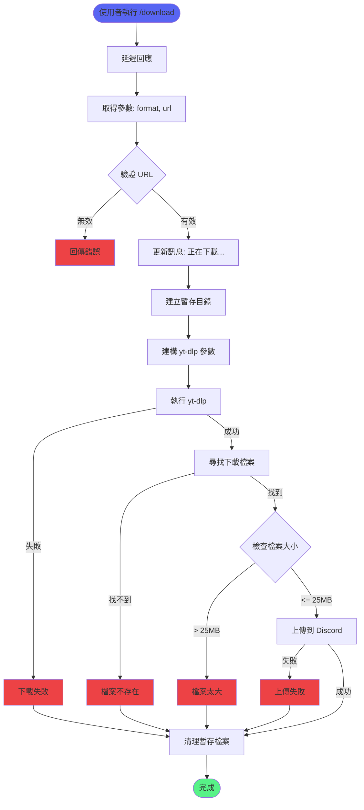

# 下載功能

> 負責下載 YouTube 音訊檔案到本地並上傳到 Discord
> 檔案：`internal/command/download.go`

## 功能概述

下載功能提供：
- 多格式音訊下載（MP3, M4A, Opus, FLAC, WAV）
- 自動音訊轉換
- 檔案大小限制（25 MB）
- 時長限制（10 分鐘）
- 自動清理暫存檔案

## 支援格式

| 格式 | 位元率/品質 | 檔案大小 | 適用場景 |
|------|------------|---------|---------|
| MP3 320kbps | 320 kbps | 中等 | 推薦，相容性最好 |
| M4A 256kbps | 256 kbps | 較小 | Apple 裝置最佳化 |
| Opus 192kbps | 192 kbps | 最小 | 網路傳輸最佳化 |
| FLAC | 無損 | 較大 | 音質最佳 |
| WAV | 原始 | 最大 | 未壓縮音訊 |

## 完整流程圖



## 核心函式

### 1. downloadCommandHandler

**位置**：`internal/command/download.go:45`

**功能**：處理 `/download` 指令的主入口

**程式碼**：
```go
func downloadCommandHandler(event *events.ApplicationCommandInteractionCreate) {
    // 1. Defer response 避免逾時
    if err := event.DeferCreateMessage(false); err != nil {
        log.Printf("failed to defer response: %v", err)
        return
    }

    // 2. 取得參數
    data := event.SlashCommandInteractionData()
    format := data.String("format")
    url := data.String("url")

    if url == "" {
        updateResponse(event, "❌ 請提供 YouTube 網址")
        return
    }

    // 3. 更新狀態
    updateResponse(event, "⏳ 正在下載音訊檔案，請稍候...")

    // 4. 下載檔案
    downloadedFile, err := downloadAudioFile(format, url, event.User().ID.String())
    if err != nil {
        updateResponse(event, fmt.Sprintf("❌ 下載失敗：%v", err))
        return
    }
    defer os.Remove(downloadedFile) // 清理檔案

    // 5. 驗證並上傳檔案
    if err := validateAndUploadFile(event, downloadedFile); err != nil {
        updateResponse(event, fmt.Sprintf("❌ %v", err))
    }
}
```

---

### 2. downloadAudioFile

**位置**：`internal/command/download.go:78`

**功能**：下載音訊檔案並回傳檔案路徑

**參數**：
- `format string` - 音訊格式（mp3-320, m4a-256, opus-192, flac, wav）
- `url string` - YouTube 影片 URL
- `userID string` - 使用者 ID（用於產生唯一檔案名）

**程式碼**：
```go
func downloadAudioFile(format, url, userID string) (string, error) {
    // 1. 建立暫存目錄
    tempDir := filepath.Join(os.TempDir(), "discord-downloads")
    os.MkdirAll(tempDir, 0755)

    // 2. 產生唯一檔案名
    timestamp := time.Now().Unix()
    outputTemplate := filepath.Join(tempDir, 
        fmt.Sprintf("%s_%d_%%(title)s.%%(ext)s", userID, timestamp))

    // 3. 執行 yt-dlp
    args := buildYtDlpArgs(format, url, outputTemplate)
    ctx, cancel := context.WithTimeout(context.Background(), 5*time.Minute)
    defer cancel()

    cmd := exec.CommandContext(ctx, "yt-dlp", args...)
    output, err := cmd.CombinedOutput()
    if err != nil {
        log.Printf("yt-dlp error: %v, output: %s", err, string(output))
        return "", err
    }

    // 4. 尋找下載的檔案
    files, err := filepath.Glob(filepath.Join(tempDir, 
        fmt.Sprintf("%s_%d_*", userID, timestamp)))
    if err != nil || len(files) == 0 {
        return "", fmt.Errorf("找不到下載的檔案")
    }

    return files[0], nil
}
```

**逾時設定**：5 分鐘（適合大多數 10 分鐘以內的影片）

---

### 3. buildYtDlpArgs

**位置**：`internal/command/download.go:159`

**功能**：根據格式建構 yt-dlp 指令參數

**程式碼**：
```go
func buildYtDlpArgs(format, url, outputTemplate string) []string {
    args := []string{
        "--no-playlist",                    // 不下載播放清單
        "--max-filesize", "25M",           // 最大檔案大小 25MB
        "--match-filter", "duration < 600", // 限制 10 分鐘
        "--output", outputTemplate,         // 輸出檔案範本
    }

    // 根據格式加入轉換參數
    switch format {
    case "mp3-320":
        args = append(args, 
            "--extract-audio",           // 只提取音訊
            "--audio-format", "mp3",     // 轉換為 MP3
            "--audio-quality", "0")      // 最高品質（320kbps）
            
    case "m4a-256":
        args = append(args, 
            "--extract-audio", 
            "--audio-format", "m4a", 
            "--audio-quality", "256K")
            
    case "opus-192":
        args = append(args, 
            "--extract-audio", 
            "--audio-format", "opus", 
            "--audio-quality", "192K")
            
    case "flac":
        args = append(args, 
            "--extract-audio", 
            "--audio-format", "flac")    // 無損，無需指定品質
            
    case "wav":
        args = append(args, 
            "--extract-audio", 
            "--audio-format", "wav")     // 原始 PCM
            
    default:
        // 預設使用 MP3 320kbps
        args = append(args, 
            "--extract-audio", 
            "--audio-format", "mp3", 
            "--audio-quality", "0")
    }

    args = append(args, url)
    return args
}
```

**關鍵參數說明**：
- `--no-playlist` - 防止下載整個播放清單
- `--max-filesize 25M` - Discord 免費使用者上傳限制
- `--match-filter "duration < 600"` - 只下載 10 分鐘以內的影片
- `--extract-audio` - 只提取音訊，丟棄影片
- `--audio-quality 0` - 對於 MP3，0 表示最高品質

---

### 4. validateAndUploadFile

**位置**：`internal/command/download.go:108`

**功能**：驗證檔案大小並上傳到 Discord

**程式碼**：
```go
func validateAndUploadFile(event *events.ApplicationCommandInteractionCreate, filePath string) error {
    // 1. 檢查檔案大小
    fileInfo, err := os.Stat(filePath)
    if err != nil {
        return fmt.Errorf("無法讀取檔案資訊：%v", err)
    }

    fileSize := fileInfo.Size()
    maxSize := int64(25 * 1024 * 1024) // 25 MB

    if fileSize > maxSize {
        sizeMB := float64(fileSize) / 1024 / 1024
        return fmt.Errorf("檔案太大 (%.2f MB)\n💡 建議：使用 Opus 格式或選擇較短的歌曲", sizeMB)
    }

    // 2. 上傳檔案
    file, err := os.Open(filePath)
    if err != nil {
        return fmt.Errorf("無法開啟檔案：%v", err)
    }
    defer file.Close()

    fileName := filepath.Base(filePath)
    sizeMB := float64(fileSize) / 1024 / 1024
    message := fmt.Sprintf("✅ **下載完成！**\n📦 檔案：`%s`\n📊 大小：%.2f MB", fileName, sizeMB)

    // 3. 更新回應並附加檔案
    _, err = event.Client().Rest().UpdateInteractionResponse(
        event.ApplicationID(),
        event.Token(),
        discord.MessageUpdate{
            Content: &message,
            Files: []*discord.File{
                {
                    Name:   fileName,
                    Reader: file,
                },
            },
        },
    )

    if err != nil {
        return fmt.Errorf("上傳檔案失敗：%v", err)
    }

    log.Printf("Successfully downloaded and uploaded: %s (%.2f MB)", fileName, sizeMB)
    return nil
}
```

---

## 限制與約束

### Discord 限制

| 項目 | 免費使用者 | Nitro Basic | Nitro |
|------|-----------|------------|-------|
| 檔案大小 | 25 MB | 50 MB | 500 MB |

**目前實作**：針對免費使用者，限制 25 MB

### yt-dlp 限制

```bash
# 指令列限制
yt-dlp --max-filesize 25M --match-filter "duration < 600" [URL]
```

- `--max-filesize 25M` - 下載前檢查檔案大小
- `duration < 600` - 只下載 10 分鐘（600 秒）以內的影片

---

## 格式對比

### 檔案大小估算（3 分鐘歌曲）

| 格式 | 位元率 | 估算大小 | 實際測試 |
|------|--------|---------|---------|
| Opus 192kbps | 192 kbps | ~4.3 MB | 3.8-4.5 MB |
| M4A 256kbps | 256 kbps | ~5.8 MB | 5.2-6.1 MB |
| MP3 320kbps | 320 kbps | ~7.2 MB | 6.8-7.5 MB |
| FLAC | ~1000 kbps | ~22.5 MB | 18-25 MB |
| WAV | 1411 kbps | ~31.7 MB | 30-32 MB |

**推薦**：
- 一般使用：**MP3 320kbps**（相容性好）
- 節省空間：**Opus 192kbps**（品質仍然很好）
- 追求音質：**FLAC**（但可能超過 25 MB）

---

## 錯誤處理

### 常見錯誤

| 錯誤 | 原因 | 解決方案 |
|------|------|---------|
| 檔案太大 | 超過 25 MB | 使用 Opus 格式或選擇較短歌曲 |
| 下載逾時 | 網路慢或影片太長 | 增加逾時時間或選擇較短影片 |
| 找不到檔案 | yt-dlp 失敗 | 檢查 URL 是否有效 |
| 影片不可用 | 地區限制或版權 | 選擇其他影片 |
| 上傳失敗 | Discord API 錯誤 | 重試或檢查網路 |

---

## 相關文件

- [音樂播放功能](音樂播放功能.md) - 播放功能
- [專有名詞索引](../知識庫/專有名詞索引.md) - yt-dlp 術語

---

## 測試覆蓋

- `download_test.go` - 下載指令測試
- 測試場景：
  - ✅ 正常下載流程
  - ✅ 檔案大小驗證
  - ✅ 格式參數建構
  - ✅ 錯誤處理
  - ✅ 暫存檔案清理
