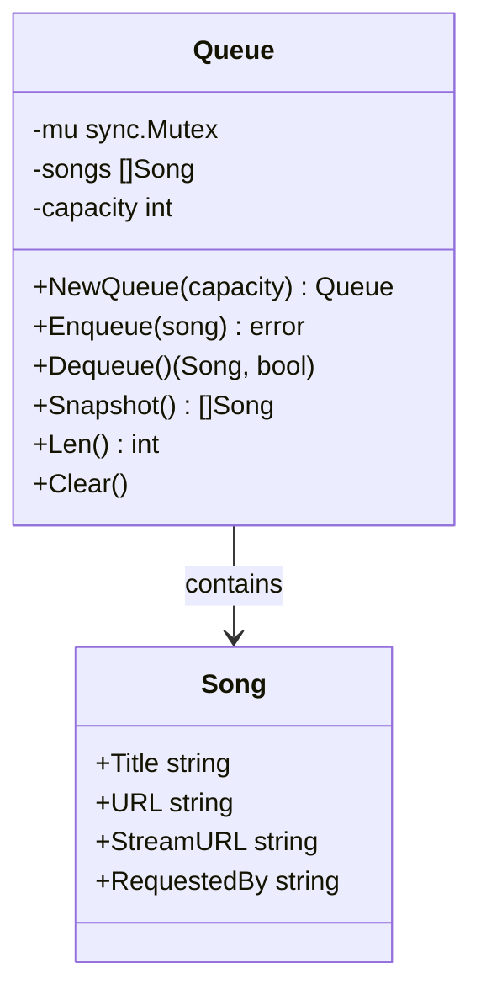
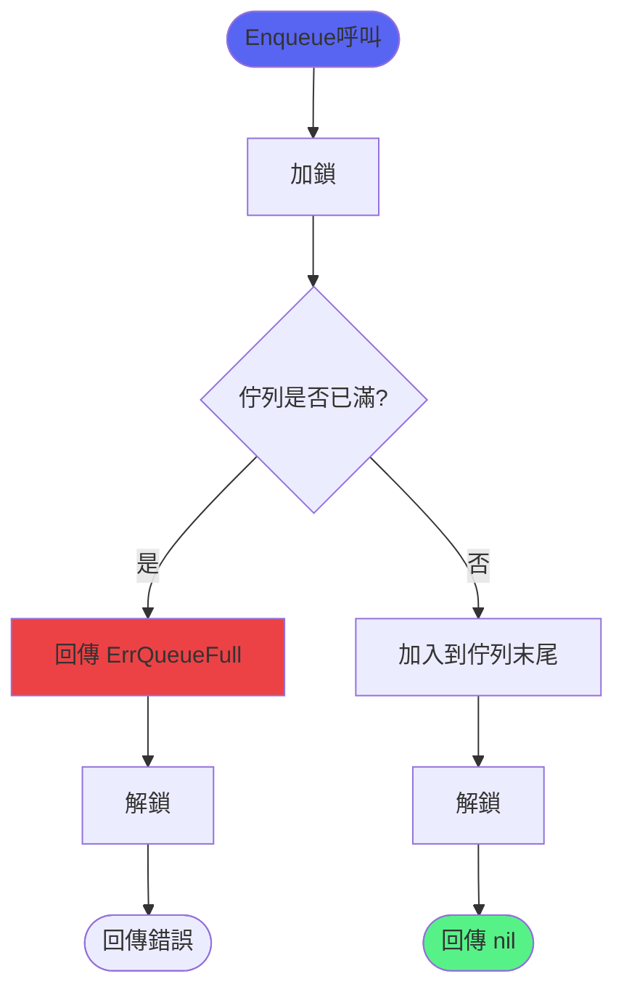
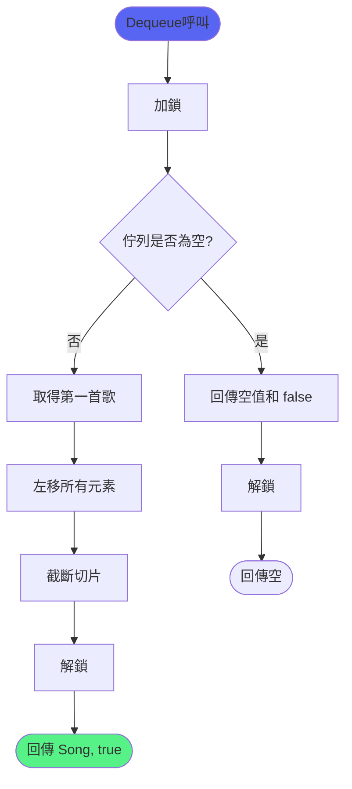
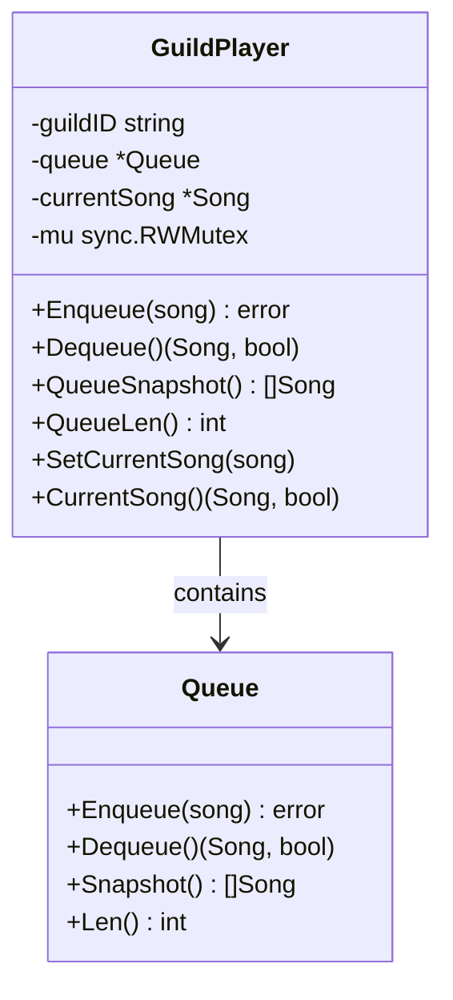
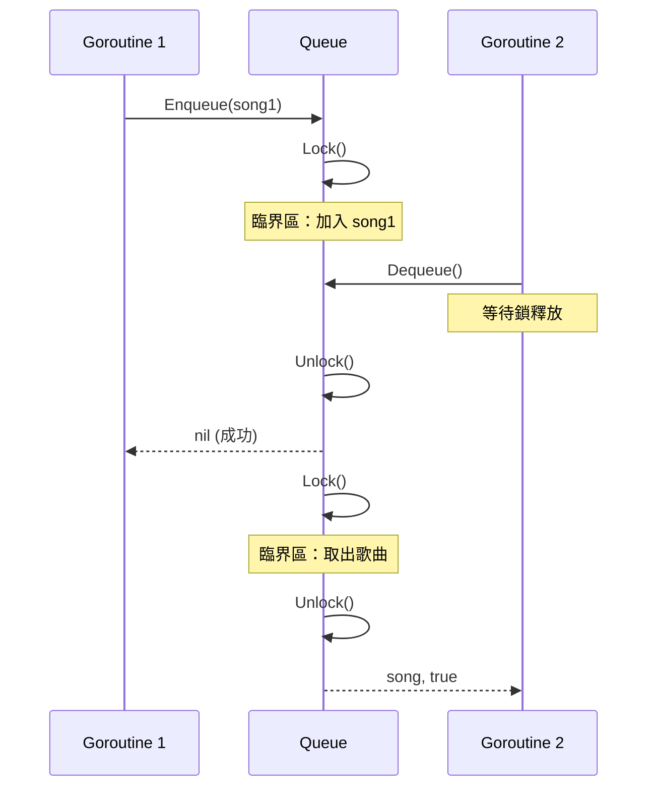

# 佇列管理功能

> 負責管理播放佇列，提供執行緒安全的 FIFO 佇列實作
> 檔案：`internal/player/queue.go`, `internal/player/player.go`

## 功能概述

佇列管理功能提供：
- 執行緒安全的 FIFO 佇列
- 固定容量限制
- 快照功能（不消費佇列）
- 佇列操作：入隊、出隊、清空

## 核心資料結構



## 核心流程

### 入隊流程



### 出隊流程



## 核心函式

### 1. NewQueue

**位置**：`internal/player/queue.go:13`

**功能**：建立指定容量的佇列

**參數**：
- `capacity int` - 佇列最大容量

**回傳**：
- `*Queue` - 佇列實例

**程式碼**：
```go
func NewQueue(capacity int) *Queue {
    if capacity < 0 {
        capacity = 0
    }
    return &Queue{
        songs:    make([]Song, 0, capacity),
        capacity: capacity,
    }
}
```

---

### 2. Enqueue

**位置**：`internal/player/queue.go:24`

**功能**：將歌曲加入佇列末端

**參數**：
- `song Song` - 要加入的歌曲

**回傳**：
- `error` - 成功回傳 `nil`，佇列已滿回傳 `ErrQueueFull`

**程式碼**：
```go
func (q *Queue) Enqueue(song Song) error {
    q.mu.Lock()
    defer q.mu.Unlock()

    if len(q.songs) >= q.capacity {
        return ErrQueueFull
    }

    q.songs = append(q.songs, song)
    return nil
}
```

**並行安全**：
- 使用 `sync.Mutex` 保護共享狀態
- `defer` 確保即使 panic 也會解鎖

---

### 3. Dequeue

**位置**：`internal/player/queue.go:37`

**功能**：移除並回傳 FIFO 順序中的下一首歌曲

**回傳**：
- `Song` - 出隊的歌曲
- `bool` - 是否成功（佇列為空時回傳 false）

**程式碼**：
```go
func (q *Queue) Dequeue() (Song, bool) {
    q.mu.Lock()
    defer q.mu.Unlock()

    if len(q.songs) == 0 {
        return Song{}, false  // 回傳空 Song 和 false
    }

    song := q.songs[0]
    copy(q.songs, q.songs[1:])
    q.songs = q.songs[:len(q.songs)-1]
    return song, true
}
```

**實作細節**：
1. 取得第一個元素
2. 將後續元素向前移動（使用 `copy`）
3. 截斷切片長度
4. 回傳歌曲和成功標記

**效能**：
- 時間複雜度：O(n)
- 空間複雜度：O(1)（原地操作）

---

### 4. Snapshot

**位置**：`internal/player/queue.go:52`

**功能**：回傳佇列的副本，不消費佇列內容

**回傳**：
- `[]Song` - 歌曲切片副本

**程式碼**：
```go
func (q *Queue) Snapshot() []Song {
    q.mu.Lock()
    defer q.mu.Unlock()

    snapshot := make([]Song, len(q.songs))
    copy(snapshot, q.songs)
    return snapshot
}
```

**用途**：
- 顯示佇列內容（`/queue` 指令）
- 唯讀操作，不影響佇列狀態
- 回傳深拷貝，避免並行問題

---

### 5. Len

**位置**：`internal/player/queue.go:62`

**功能**：回傳目前佇列中的歌曲數量

**回傳**：
- `int` - 佇列長度

**程式碼**：
```go
func (q *Queue) Len() int {
    q.mu.Lock()
    defer q.mu.Unlock()

    return len(q.songs)
}
```

---

### 6. Clear

**位置**：`internal/player/queue.go:70`

**功能**：移除所有已加入佇列的歌曲

**程式碼**：
```go
func (q *Queue) Clear() {
    q.mu.Lock()
    defer q.mu.Unlock()

    q.songs = q.songs[:0]
}
```

---

## GuildPlayer 佇列整合

### GuildPlayer 結構

**位置**：`internal/player/player.go:28`



### GuildPlayer.Enqueue

**位置**：`internal/player/player.go:57`

**功能**：將歌曲加入播放佇列，播放器停止後回傳錯誤

**程式碼**：
```go
func (p *GuildPlayer) Enqueue(song Song) error {
    p.mu.RLock()
    stopped := p.stopped
    p.mu.RUnlock()
    if stopped {
        return ErrPlayerStopped
    }

    return p.queue.Enqueue(song)
}
```

**增強功能**：
- 檢查播放器是否已停止
- 防止向已停止的播放器加入歌曲

---

## Song 結構

**位置**：`internal/player/song.go`

**定義**：
```go
type Song struct {
    Title       string // 歌曲標題
    URL         string // 原始 URL
    StreamURL   string // 串流媒體 URL
    RequestedBy string // 請求者 ID
}
```

---

## 並行安全

佇列使用 `sync.Mutex` 確保執行緒安全：



**保護的操作**：
- ✅ 讀取佇列長度
- ✅ 加入歌曲
- ✅ 移除歌曲
- ✅ 快照操作
- ✅ 清空佇列

---

## 錯誤類型

### ErrQueueFull

**位置**：`internal/player/errors.go`

**說明**：佇列已達到容量限制

**處理**：
```go
err := queue.Enqueue(song)
if errors.Is(err, player.ErrQueueFull) {
    // 通知使用者佇列已滿
    return fmt.Errorf("佇列已滿，請稍後再試")
}
```

---

## 效能特性

| 操作 | 時間複雜度 | 空間複雜度 |
|------|-----------|-----------|
| Enqueue | O(1)* | O(1) |
| Dequeue | O(n) | O(1) |
| Snapshot | O(n) | O(n) |
| Len | O(1) | O(1) |
| Clear | O(1) | O(1) |

*: 攤銷時間複雜度（切片擴容時為 O(n)）

---

## 使用範例

### 建立佇列

```go
// 建立容量為 50 的佇列
queue := player.NewQueue(50)
```

### 加入歌曲

```go
song := player.Song{
    Title:       "Never Gonna Give You Up",
    URL:         "https://youtube.com/watch?v=dQw4w9WgXcQ",
    RequestedBy: "user123",
}

err := queue.Enqueue(song)
if err == player.ErrQueueFull {
    // 佇列已滿
}
```

### 取出歌曲

```go
nextSong, ok := queue.Dequeue()
if !ok {
    // 佇列為空
    return
}

// 播放 nextSong
```

### 查看佇列

```go
songs := queue.Snapshot()
for i, song := range songs {
    fmt.Printf("%d. %s\n", i+1, song.Title)
}
```

---

## 相關文件

- [音樂播放功能](音樂播放功能.md) - 播放功能
- [播放控制功能](播放控制功能.md) - 控制操作
- [自動播放下一首流程](../流程圖/自動播放下一首流程.md) - 自動播放

---

## 測試覆蓋

- `queue_test.go` - 佇列單元測試
- `player_test.go` - GuildPlayer 測試
- 測試覆蓋率：> 90%

**測試場景**：
- ✅ 基本入隊/出隊
- ✅ 佇列已滿處理
- ✅ 佇列為空處理
- ✅ 並行安全測試
- ✅ 快照功能測試
