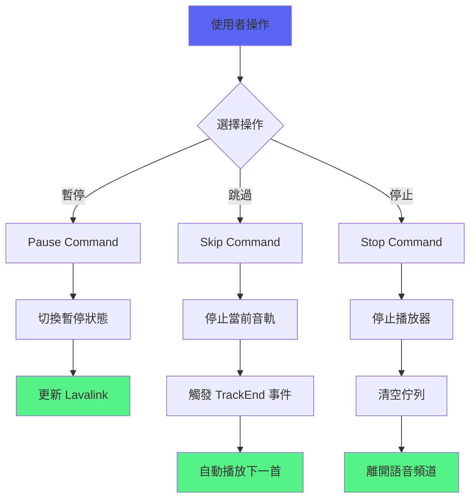
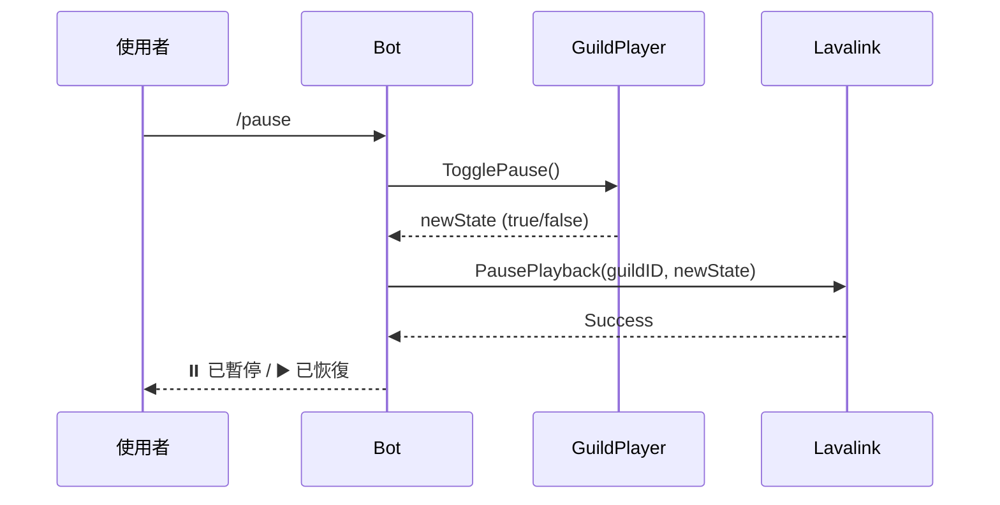
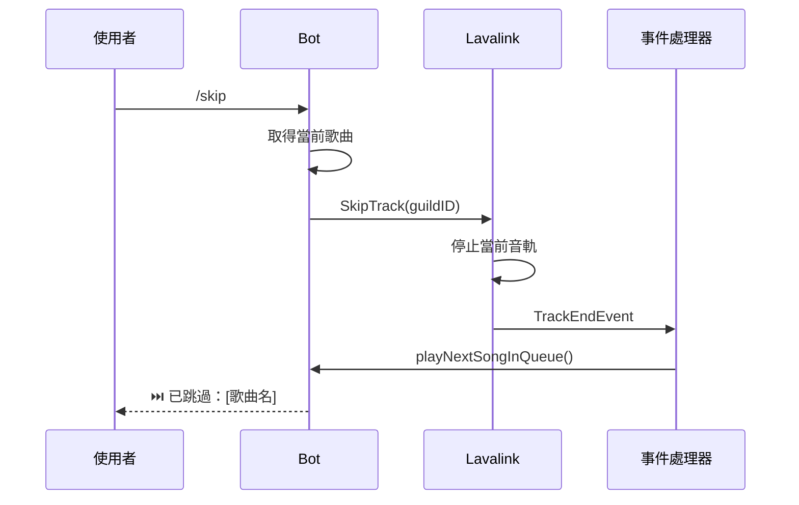
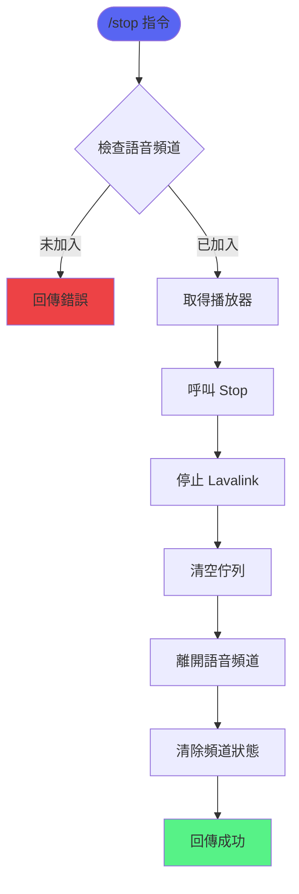
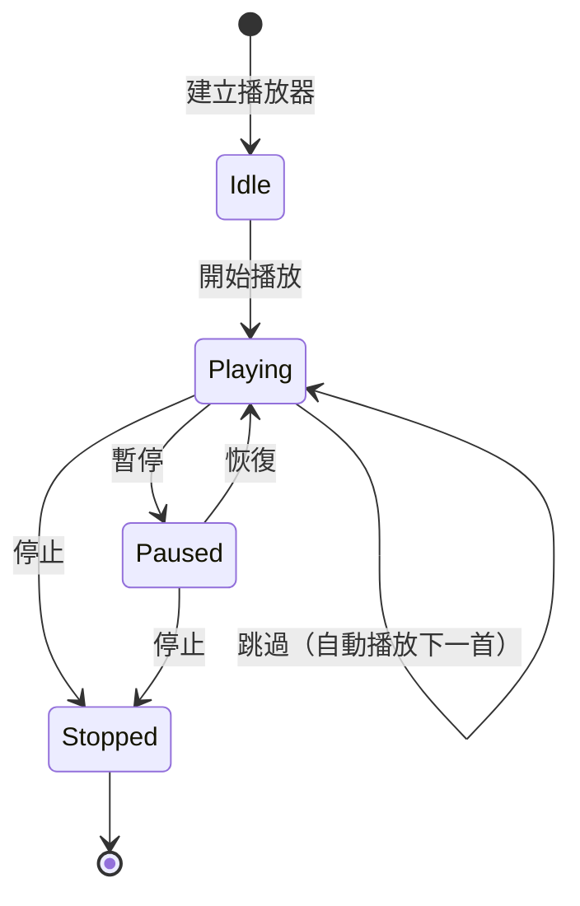

# 播放控制功能

> 負責音樂播放的控制操作：暫停、恢復、跳過、停止、循環
> 檔案：`internal/command/pause.go`, `internal/command/skip.go`, `internal/command/stop.go`, `internal/command/loop.go`

## 功能概述

播放控制功能提供：
- ⏸️ 暫停/恢復播放
- ⏭️ 跳過當前歌曲
- ⏹️ 停止播放並清空佇列
- 🔁 循環播放模式
- 🎵 當前播放資訊

## 控制流程圖



## 核心函式

### 1. pauseCommandHandler

**位置**：`internal/command/pause.go`

**功能**：暫停或恢復當前播放

**流程**：


**程式碼**：
```go
func pauseCommandHandler(event *events.ApplicationCommandInteractionCreate) {
    // 1. 檢查使用者是否在語音頻道
    guildID, _, ok := getVoiceContext(event)
    if !ok {
        respondError(event, "你必須在語音頻道中才能使用此指令")
        return
    }
    
    // 2. 取得播放器
    guildPlayer := musicService.GetOrCreatePlayer(guildID.String())
    
    // 3. 切換暫停狀態
    newPauseState := guildPlayer.TogglePause()
    
    // 4. 更新 Lavalink 播放器
    err := PausePlayback(guildID, newPauseState)
    if err != nil {
        respondError(event, "暫停操作失敗")
        return
    }
    
    // 5. 回應使用者
    if newPauseState {
        respondSuccess(event, "⏸️ 已暫停播放")
    } else {
        respondSuccess(event, "▶️ 已恢復播放")
    }
}
```

---

### 2. skipCommandHandler

**位置**：`internal/command/skip.go`

**功能**：跳過當前播放的歌曲

**流程**：


**程式碼**：
```go
func skipCommandHandler(event *events.ApplicationCommandInteractionCreate) {
    // 1. 檢查語音上下文
    guildID, _, ok := getVoiceContext(event)
    if !ok {
        respondError(event, "你必須在語音頻道中")
        return
    }
    
    // 2. 取得當前播放的歌曲
    guildPlayer := musicService.GetOrCreatePlayer(guildID.String())
    currentSong, ok := guildPlayer.CurrentSong()
    if !ok {
        respondError(event, "目前沒有播放歌曲")
        return
    }
    
    // 3. 跳過當前音軌
    err := SkipTrack(guildID)
    if err != nil {
        respondError(event, "跳過失敗")
        return
    }
    
    // 4. 回應使用者
    message := fmt.Sprintf("⏭️ 已跳過：**%s**", currentSong.Title)
    respondSuccess(event, message)
}
```

---

### 3. stopCommandHandler

**位置**：`internal/command/stop.go`

**功能**：停止播放、清空佇列、離開語音頻道

**流程**：


**程式碼**：
```go
func stopCommandHandler(event *events.ApplicationCommandInteractionCreate) {
    // 1. 檢查語音上下文
    guildID, channelID, ok := getVoiceContext(event)
    if !ok {
        respondError(event, "你必須在語音頻道中")
        return
    }
    
    // 2. 取得播放器並停止
    guildPlayer := musicService.GetOrCreatePlayer(guildID.String())
    guildPlayer.Stop()
    
    // 3. 停止 Lavalink 播放
    err := StopPlayback(event.Client(), guildID)
    if err != nil {
        log.Printf("Stop playback failed: %v", err)
    }
    
    // 4. 清除語音頻道狀態
    go ClearVoiceChannelStatus(event.Client(), channelID)
    
    // 5. 回應使用者
    respondSuccess(event, "⏹️ 已停止播放並清空佇列")
}
```

---

## 狀態管理

### GuildPlayer 狀態機



### 狀態屬性

| 狀態 | currentSong | paused | stopped | 佇列 |
|------|-------------|--------|---------|------|
| Idle | nil | false | false | 空 |
| Playing | Song | false | false | 有/無 |
| Paused | Song | true | false | 有/無 |
| Stopped | nil | false | true | 空 |

---

## 輔助函式

### PausePlayback

**位置**：`internal/command/voice.go:128`

**功能**：透過 Lavalink 暫停或恢復播放

**程式碼**：
```go
func PausePlayback(guildID snowflake.ID, pause bool) error {
    ctx := context.Background()

    lavalinkClient := GetLavalinkClient()
    if lavalinkClient == nil {
        return fmt.Errorf("lavalink client not initialized")
    }

    player := lavalinkClient.Player(guildID)
    err := player.Update(ctx, lavalink.WithPaused(pause))
    if err != nil {
        return fmt.Errorf("failed to update pause state: %w", err)
    }

    return nil
}
```

---

### SkipTrack

**位置**：`internal/command/voice.go:146`

**功能**：停止當前音軌，觸發自動播放下一首

**程式碼**：
```go
func SkipTrack(guildID snowflake.ID) error {
    ctx := context.Background()

    lavalinkClient := GetLavalinkClient()
    if lavalinkClient == nil {
        return fmt.Errorf("lavalink client not initialized")
    }

    player := lavalinkClient.Player(guildID)
    // 停止當前音軌，觸發 TrackEnd 事件
    err := player.Update(ctx, lavalink.WithNullTrack())
    if err != nil {
        return fmt.Errorf("failed to skip track: %w", err)
    }

    return nil
}
```

**工作原理**：
1. 發送 `WithNullTrack()` 停止當前音軌
2. Lavalink 觸發 `TrackEndEvent`
3. 事件處理器自動播放下一首

---

### StopPlayback

**位置**：`internal/command/voice.go:96`

**功能**：停止播放並離開語音頻道

**程式碼**：
```go
func StopPlayback(client bot.Client, guildID snowflake.ID) error {
    ctx := context.Background()

    // 停止 Lavalink player
    lavalinkClient := GetLavalinkClient()
    if lavalinkClient != nil {
        player := lavalinkClient.Player(guildID)
        err := player.Update(ctx, lavalink.WithNullTrack())
        if err != nil {
            log.Printf("[Lavalink] Failed to stop player: %v", err)
        }
    }

    // 離開語音頻道
    err := client.UpdateVoiceState(ctx, guildID, nil, false, false)
    if err != nil {
        return fmt.Errorf("failed to leave voice channel: %w", err)
    }

    return nil
}
```

---

## 錯誤處理

| 錯誤情況 | 處理方式 |
|---------|---------|
| 使用者未在語音頻道 | 提示 "你必須在語音頻道中" |
| 沒有正在播放的歌曲 | 提示 "目前沒有播放歌曲" |
| Lavalink 未初始化 | 回傳 "lavalink client not initialized" |
| 播放器已停止 | 回傳 `ErrPlayerStopped` |

---

## 相關文件

- [佇列管理功能](佇列管理功能.md) - 播放器實作
- [Lavalink整合](Lavalink整合.md) - 自動播放下一首
- [音樂播放功能](音樂播放功能.md) - 播放功能

---

## 測試覆蓋

- `pause_test.go` - 暫停指令測試
- `skip_test.go` - 跳過指令測試
- `stop_test.go` - 停止指令測試
- 測試覆蓋率：> 85%

### 4. Loop 指令

**位置**：`internal/command/loop.go:20`

**功能**：切換循環播放模式

**指令**：`/loop`

**循環模式**：
1. 🔁 **關閉**（預設）- 正常播放，不循環
2. 🔂 **單曲循環一次** - 當前歌曲播放完後重複一次，然後自動關閉
3. 🔁 **單曲無限循環** - 當前歌曲無限循環播放

**切換順序**：關閉 → 單曲循環一次 → 單曲無限循環 → 關閉

**程式碼**：
```go
func loopCommandHandler(event *events.ApplicationCommandInteractionCreate) {
    // 檢查使用者是否在語音頻道
    guildID, _, ok := getVoiceContext(event)
    if !ok {
        updateResponse(event, "❌ 你必須在語音頻道中才能使用此指令")
        return
    }

    // 取得播放器
    guildPlayer := musicService.GetOrCreatePlayer(guildID.String())

    // 切換循環模式
    newMode := guildPlayer.ToggleLoopMode()

    // 建構回應訊息
    icon := newMode.Icon()
    modeName := newMode.String()
    message := fmt.Sprintf("%s **循環模式：%s**", icon, modeName)

    // 回應使用者
    event.CreateMessage(discord.MessageCreate{Content: message})
}
```

**循環實作**：
```go
// handleLoopMode 處理循環播放邏輯
func (b *Bot) handleLoopMode(player disgolink.Player) {
    guildPlayer, _ := b.playerManager.Get(player.GuildID().String())
    currentSong, hasSong := guildPlayer.CurrentSong()
    if !hasSong {
        return
    }

    loopMode := guildPlayer.GetLoopMode()

    switch loopMode {
    case LoopSingleOnce:
        // 將當前歌曲插入到佇列最前面，然後關閉循環
        guildPlayer.EnqueueFront(currentSong)
        guildPlayer.SetLoopMode(LoopOff)
        
    case LoopSingleInfinite:
        // 將當前歌曲插入到佇列最前面
        guildPlayer.EnqueueFront(currentSong)
        
    case LoopOff:
        // 不循環，什麼都不做
    }
}
```

**播放順序範例**：
```
佇列狀態：A（播放中）, B, C

啟用單曲循環一次：
A → A（重複）→ B → C

啟用單曲無限循環：
A → A → A → A → ... （無限循環）

關閉循環：
A → B → C （正常順序）
```

**特點**：
- ✅ 單曲循環一次會自動關閉，無需手動切換
- ✅ 循環歌曲插入到佇列最前面，確保正確的播放順序
- ✅ 按鈕會根據當前模式顯示不同的顏色和圖示
- ✅ 可透過 `/loop` 指令或控制面板按鈕切換

---
