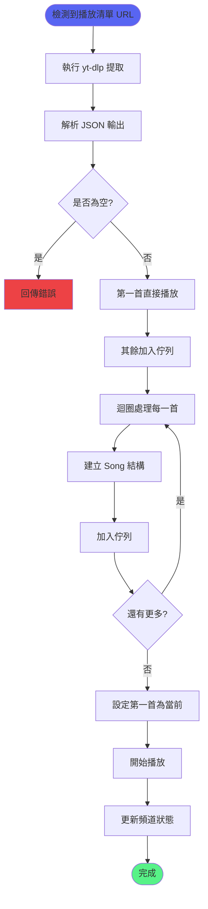
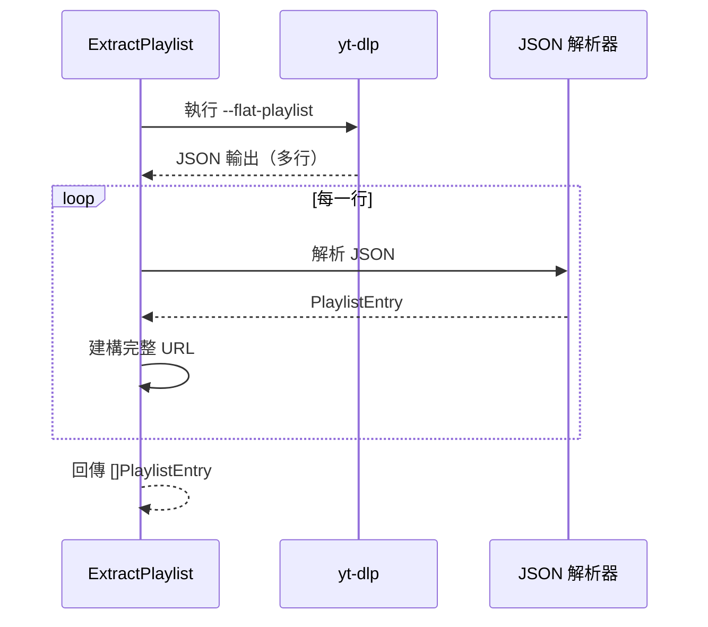

# 播放清單功能

> 負責播放清單的解析與播放
> 檔案：`internal/command/playlist.go`

## 功能概述

播放清單功能提供：
- YouTube 播放清單 URL 檢測
- 快速提取播放清單資訊
- 批次加入佇列
- 自動播放第一首

## 播放清單處理流程



## 核心函式

### 1. IsPlaylistURL

**位置**：`internal/command/playlist.go:92`

**功能**：檢查 URL 是否包含播放清單

**程式碼**：
```go
func IsPlaylistURL(url string) bool {
    return strings.Contains(url, "list=") || strings.Contains(url, "/playlist?")
}
```

**檢測範例**：
```go
// ✅ 播放清單 URL
IsPlaylistURL("https://www.youtube.com/playlist?list=PLxxxxxx")  // true
IsPlaylistURL("https://www.youtube.com/watch?v=xxx&list=PLyyy")  // true

// ❌ 單曲 URL
IsPlaylistURL("https://www.youtube.com/watch?v=dQw4w9WgXcQ")    // false
```

---

### 2. ExtractPlaylist

**位置**：`internal/command/playlist.go:24`

**功能**：使用 yt-dlp 提取播放清單

**流程**：


**程式碼**：
```go
func ExtractPlaylist(youtubeURL string) ([]PlaylistEntry, error) {
    ctx, cancel := context.WithTimeout(context.Background(), 60*time.Second)
    defer cancel()

    log.Printf("[yt-dlp] 提取播放清單: %s", youtubeURL)

    // 使用 flat-playlist 快速提取播放清單資訊
    cmd := exec.CommandContext(ctx, "yt-dlp",
        "--dump-json",
        "--flat-playlist",
        "--skip-download",
        youtubeURL,
    )

    output, err := cmd.Output()
    if err != nil {
        return nil, fmt.Errorf("yt-dlp 提取播放清單失敗: %w", err)
    }

    // 解析每一行 JSON
    lines := strings.Split(string(output), "\n")
    var entries []PlaylistEntry

    for _, line := range lines {
        line = strings.TrimSpace(line)
        if line == "" {
            continue
        }

        var entry PlaylistEntry
        if err := json.Unmarshal([]byte(line), &entry); err != nil {
            log.Printf("[yt-dlp] 解析項目失敗: %v", err)
            continue
        }

        // 建構完整 URL
        if entry.ID != "" {
            entry.URL = "https://www.youtube.com/watch?v=" + entry.ID
            entries = append(entries, entry)
        }
    }

    log.Printf("[yt-dlp] 成功提取 %d 首歌曲", len(entries))
    return entries, nil
}
```

**yt-dlp 參數說明**：
- `--dump-json` - 輸出 JSON 格式
- `--flat-playlist` - 快速模式，不下載影片資訊
- `--skip-download` - 不下載影片

---

### 3. PlaylistEntry 結構

**位置**：`internal/command/playlist.go:17`

**定義**：
```go
type PlaylistEntry struct {
    ID    string `json:"id"`      // 影片 ID
    Title string `json:"title"`   // 影片標題
    URL   string `json:"url"`     // 完整 URL
}
```

---

### 4. handlePlaylist（在 play.go 中）

**位置**：`internal/command/play.go:134`

**功能**：處理播放清單的完整流程

**程式碼**：
```go
func handlePlaylist(event, query, guildID, channelID) {
    log.Printf("檢測到播放清單 URL，提取播放清單...")
    
    // 1. 提取播放清單
    entries, err := ExtractPlaylist(query)
    if err != nil {
        log.Printf("提取播放清單失敗: %v", err)
        updateResponse(event, fmt.Sprintf("❌ 提取播放清單失敗：%v", err))
        return
    }

    if len(entries) == 0 {
        updateResponse(event, "❌ 播放清單是空的")
        return
    }

    // 2. 取得播放器
    guildPlayer := musicService.GetOrCreatePlayer(guildID.String())
    
    // 3. 加入佇列（跳過第一首）
    enqueuePlaylistEntries(guildPlayer, entries, event.User().ID.String())

    // 4. 播放第一首
    err = JoinVoiceAndPlayWithYtDlp(event.Client(), guildID, channelID, entries[0].URL)
    if err != nil {
        log.Printf("播放失敗: %v", err)
        updateResponse(event, fmt.Sprintf("❌ 播放失敗：%v", err))
        return
    }

    // 5. 設定第一首為當前播放
    setFirstSongAsCurrent(guildPlayer, entries[0], event.User().ID.String())

    // 6. 更新語音頻道狀態
    go UpdateVoiceChannelStatus(event.Client(), channelID, entries[0].Title)
    
    // 7. 回應使用者
    message := buildPlaylistMessage(entries)
    updateResponseWithControlButton(event, message)
}
```

---

### 5. enqueuePlaylistEntries

**位置**：`internal/command/play.go:170`

**功能**：將播放清單項目加入佇列（跳過第一首）

**程式碼**：
```go
func enqueuePlaylistEntries(guildPlayer PlayerController, entries []PlaylistEntry, userID string) {
    for i, entry := range entries {
        if i == 0 {
            continue // 跳過第一首，因為會直接播放
        }
        
        songToAdd := player.Song{
            Title:       entry.Title,
            URL:         entry.URL,
            StreamURL:   "",
            RequestedBy: userID,
        }
        
        if err := guildPlayer.Enqueue(songToAdd); err != nil {
            log.Printf("加入佇列失敗: %s - %v", entry.Title, err)
        } else {
            log.Printf("加入佇列: %s", entry.Title)
        }
    }
}
```

---

### 6. buildPlaylistMessage

**位置**：`internal/command/play.go:200`

**功能**：建構播放清單訊息

**程式碼**：
```go
func buildPlaylistMessage(entries []PlaylistEntry) string {
    message := fmt.Sprintf("📋 **播放清單載入成功！**\n\n")
    message += fmt.Sprintf("🎵 共 **%d** 首歌曲已加入佇列\n", len(entries))
    message += fmt.Sprintf("▶️ **正在播放：** %s\n\n", entries[0].Title)
    message += "**歌曲清單：**\n"

    maxDisplay := 10
    displayCount := len(entries)
    if displayCount > maxDisplay {
        displayCount = maxDisplay
    }

    for i := 0; i < displayCount; i++ {
        prefix := ""
        if i == 0 {
            prefix = "▶️ "
        }
        message += fmt.Sprintf("%s%d. %s\n", prefix, i+1, entries[i].Title)
    }

    if len(entries) > maxDisplay {
        message += fmt.Sprintf("... 還有 %d 首歌曲", len(entries)-maxDisplay)
    }

    return message
}
```

**訊息範例**：
```
📋 **播放清單載入成功！**

🎵 共 **25** 首歌曲已加入佇列
▶️ **正在播放：** Never Gonna Give You Up

**歌曲清單：**
▶️ 1. Never Gonna Give You Up
2. Together Forever
3. Whenever You Need Somebody
...
10. Take Me to Your Heart

... 還有 15 首歌曲
```

---

## 播放清單類型

### 支援的 URL 格式

| URL 類型 | 範例 | 說明 |
|---------|------|------|
| 播放清單頁面 | `youtube.com/playlist?list=PLxxx` | 標準播放清單 |
| 影片含播放清單 | `youtube.com/watch?v=xxx&list=PLyyy` | 從特定影片開始 |
| 混合播放清單 | `youtube.com/watch?v=xxx&list=RDyyy` | YouTube Mix |

---

## 效能最佳化

### flat-playlist 優勢

使用 `--flat-playlist` 可以大幅提升速度：

| 方法 | 時間（50 首） | 說明 |
|------|-------------|------|
| 標準模式 | ~60 秒 | 下載每個影片的完整資訊 |
| flat-playlist | ~3 秒 | 只取得基本資訊 |

**速度提升**：約 20 倍

---

## 限制與注意事項

### 1. 播放清單大小限制

```go
// 建議最大播放清單大小
const MaxPlaylistSize = 100

if len(entries) > MaxPlaylistSize {
    // 只處理前 100 首
    entries = entries[:MaxPlaylistSize]
}
```

### 2. 佇列容量限制

```go
// 預設佇列容量：50
// 如果播放清單超過容量，後續歌曲無法加入
```

### 3. 逾時設定

```go
// ExtractPlaylist 逾時：60 秒
ctx, cancel := context.WithTimeout(context.Background(), 60*time.Second)
```

---

## 錯誤處理

| 錯誤 | 原因 | 處理方式 |
|------|------|---------|
| 播放清單是空的 | 無效的播放清單 ID | 提示使用者 |
| 提取逾時 | 播放清單太大 | 建議縮小範圍 |
| 解析失敗 | JSON 格式錯誤 | 記錄並跳過該項目 |
| 佇列已滿 | 超過容量限制 | 提示佇列已滿 |

---

## 使用範例

### 播放整個播放清單

```go
// 使用者輸入
/play https://www.youtube.com/playlist?list=PLxxxxxx

// 處理流程
1. 檢測為播放清單 URL
2. 提取所有影片資訊
3. 第一首直接播放
4. 其餘加入佇列
5. 回應使用者
```

### 從特定影片開始

```go
// 使用者輸入
/play https://www.youtube.com/watch?v=dQw4w9WgXcQ&list=PLxxxxxx

// 處理流程
1. 檢測為播放清單 URL
2. 提取從該影片開始的清單
3. 按順序播放
```

---

## 相關文件

- [音樂播放功能](音樂播放功能.md) - 播放功能整合
- [佇列管理功能](佇列管理功能.md) - 佇列操作
- [專有名詞索引](../知識庫/專有名詞索引.md) - yt-dlp 術語

---

## 測試覆蓋

- `playlist_test.go` - 播放清單測試
- 測試場景：
  - ✅ URL 檢測
  - ✅ 播放清單提取
  - ✅ JSON 解析
  - ✅ 佇列加入
  - ✅ 錯誤處理
