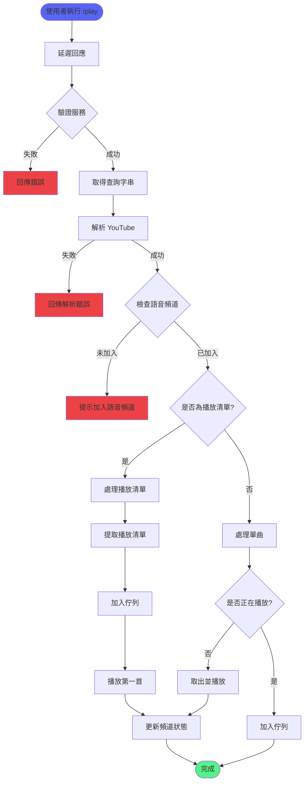
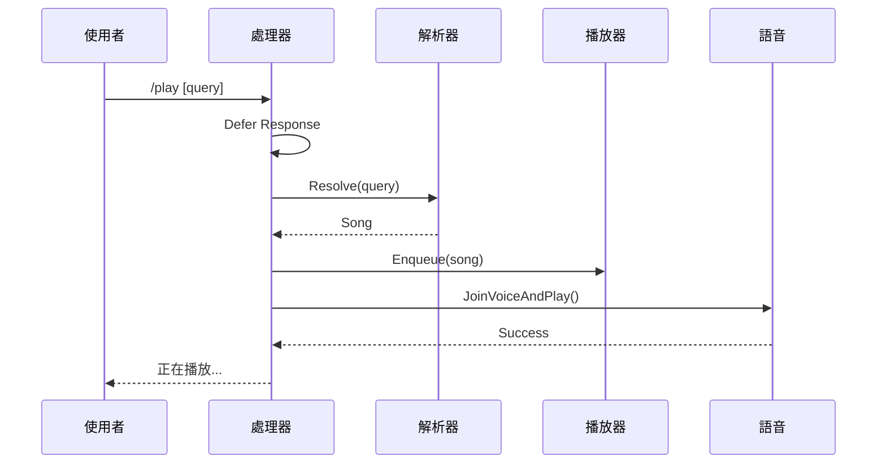
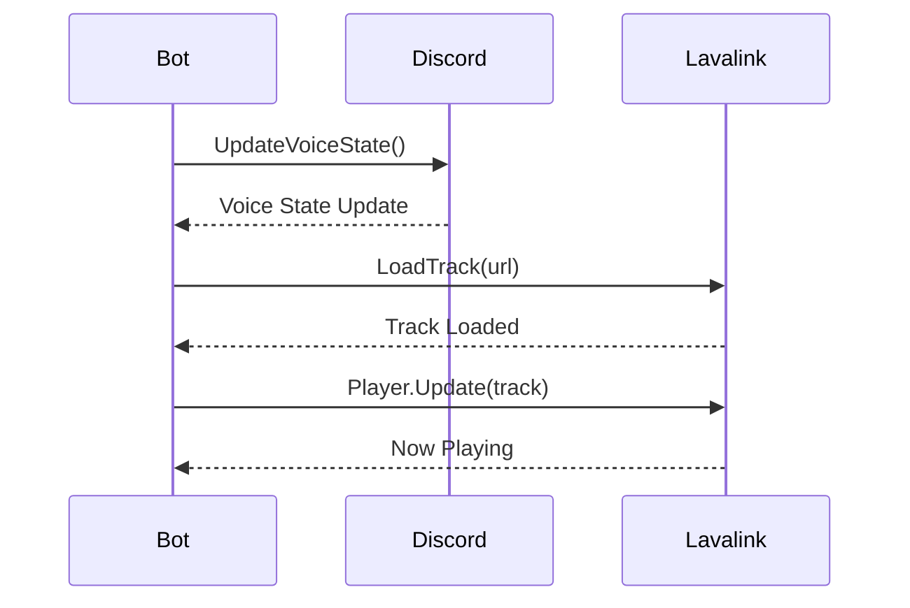
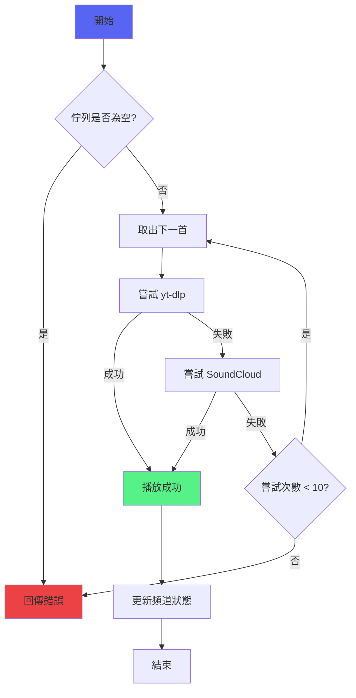

# 音樂播放功能

> 負責處理 YouTube 音樂的播放、解析和語音連接
> 檔案：`internal/command/play.go`, `internal/command/voice.go`

## 功能概述

音樂播放功能是機器人的核心功能，支援：
- YouTube URL 播放
- 搜尋關鍵字播放
- 播放清單播放
- 自動切換下一首
- 語音頻道狀態更新

## 核心流程圖



## 核心函式

### 1. playCommandHandler

**位置**：`internal/command/play.go:48`

**功能**：處理 `/play` 指令的主入口函式

**流程**：


**程式碼**：
```go
func playCommandHandler(event *events.ApplicationCommandInteractionCreate) {
    // 1. 延遲回應（避免 3 秒逾時）
    if err := event.DeferCreateMessage(false); err != nil {
        log.Printf("failed to defer response: %v", err)
        return
    }
    
    // 2. 驗證服務
    if !validateServices(event) {
        return
    }
    
    // 3. 取得查詢字串
    query := getQueryFromEvent(event)
    
    // 4. 解析歌曲
    song, err := resolveSong(query, event.User().ID.String())
    
    // 5. 取得語音上下文
    guildID, channelID, ok := getVoiceContext(event)
    
    // 6. 處理播放清單或單曲
    if IsPlaylistURL(query) {
        handlePlaylist(event, query, guildID, channelID)
    } else {
        handleSingleSong(event, song, guildID, channelID)
    }
}
```

---

### 2. handleSingleSong

**位置**：`internal/command/play.go:226`

**功能**：處理單曲播放邏輯

**參數**：
- `event` - Discord 事件
- `song` - 歌曲結構
- `guildID` - 公會 ID
- `channelID` - 語音頻道 ID

**程式碼**：
```go
func handleSingleSong(event, song, guildID, channelID) {
    guildPlayer := musicService.GetOrCreatePlayer(guildID.String())
    
    // 檢查是否正在播放
    isPlaying, _, _ := GetPlayerState(guildID)
    
    // 加入佇列
    if err := guildPlayer.Enqueue(*song); err != nil {
        // 處理錯誤
        return
    }
    
    // 如果已在播放，只需加入佇列
    if isPlaying {
        updateResponseWithControlButton(event, "已加入佇列")
        return
    }
    
    // 否則，取出並開始播放
    firstSong, ok := guildPlayer.Dequeue()
    if ok {
        guildPlayer.SetCurrentSong(firstSong)
        playWithFallback(client, guildID, channelID, &firstSong)
    }
}
```

---

### 3. JoinVoiceAndPlay

**位置**：`internal/command/voice.go:20`

**功能**：使用 Lavalink 加入語音頻道並播放音樂

**流程**：


**程式碼**：
```go
func JoinVoiceAndPlay(client, guildID, channelID, trackURL) error {
    // 1. 加入語音頻道
    err := client.UpdateVoiceState(ctx, guildID, &channelID, false, false)
    
    // 2. 取得 Lavalink client
    lavalinkClient := GetLavalinkClient()
    
    // 3. 載入音軌
    node := lavalinkClient.BestNode()
    node.LoadTracksHandler(ctx, trackURL, handler)
    
    // 4. 播放音軌
    player := lavalinkClient.Player(guildID)
    err = player.Update(ctx, lavalink.WithTrack(loadedTrack))
    
    return nil
}
```

---

### 4. PlayNextSongFromQueue

**位置**：`internal/command/voice.go:178`

**功能**：從佇列播放下一首歌曲，失敗時自動重試

**特性**：
- 最多嘗試 10 首歌曲
- 優先使用 yt-dlp
- 失敗時使用 SoundCloud 備用
- 自動跳過無法播放的歌曲

**流程**：


---

### 5. UpdateVoiceChannelStatus

**位置**：`internal/command/voice.go:224`

**功能**：更新語音頻道狀態顯示目前播放的歌曲

**Discord API**：`PUT /channels/{channel.id}/voice-status`

**限制**：
- 最大長度：500 字元
- 格式：🎵 + 歌曲標題

---

## YouTube 解析器

### Resolver 介面

**位置**：`internal/youtube/resolver.go:13`

**功能**：定義 YouTube 查詢解析介面

**介面定義**：
```go
type Resolver interface {
    // Resolve 將 YouTube URL 或搜尋關鍵字解析為 player.Song
    Resolve(ctx context.Context, query string) (player.Song, error)
}
```

### ytdlpResolver 實作

**功能**：使用 yt-dlp 解析 YouTube 查詢

**程式碼**：
```go
func (r *ytdlpResolver) Resolve(ctx context.Context, query string) (player.Song, error) {
    args := r.buildArgs(query)
    
    output, err := r.runner.Run(ctx, "yt-dlp", args...)
    if err != nil {
        return player.Song{}, err
    }
    
    var result ytdlpOutput
    if err := json.Unmarshal(output, &result); err != nil {
        return player.Song{}, err
    }
    
    return player.Song{
        Title:     result.Title,
        URL:       result.WebpageURL,
        StreamURL: result.URL,
    }, nil
}
```

---

## 輔助函式

### validateServices

**位置**：`internal/command/play.go:88`

驗證必要服務是否初始化：
- `musicService` - 音樂服務
- `youtubeResolver` - YouTube 解析器

### resolveSong

**位置**：`internal/command/play.go:107`

解析 YouTube 查詢為 `Song` 結構：
- 逾時：30 秒
- 設定 `RequestedBy` 欄位

### getVoiceContext

**位置**：`internal/command/play.go:124`

取得使用者的語音頻道上下文：
- 回傳：`guildID`, `channelID`, `ok`
- 檢查使用者是否在語音頻道

---

## 錯誤處理

| 錯誤情況 | 處理方式 |
|---------|---------|
| 服務未初始化 | 回傳友善錯誤提示 |
| YouTube 解析失敗 | 回傳 "無法解析查詢" |
| 使用者未在語音頻道 | 提示 "必須先加入語音頻道" |
| 佇列已滿 | 回傳 "無法加入佇列" |
| 播放失敗 | 嘗試 SoundCloud 備用 |

---

## 相關文件

- [播放清單功能](播放清單功能.md) - 播放清單處理
- [佇列管理功能](佇列管理功能.md) - 佇列實作
- [Lavalink整合](Lavalink整合.md) - Lavalink 音訊服務
- [自動播放下一首流程](../流程圖/自動播放下一首流程.md) - 自動播放機制

---

## 測試覆蓋

- `play_test.go` - 播放指令測試
- `voice_test.go` - 語音功能測試
- 測試覆蓋率：> 80%
