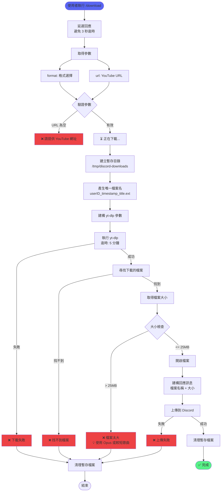
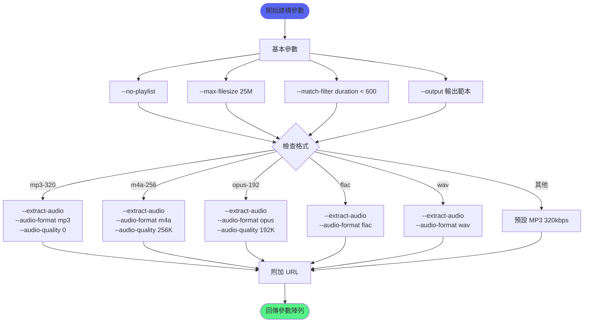
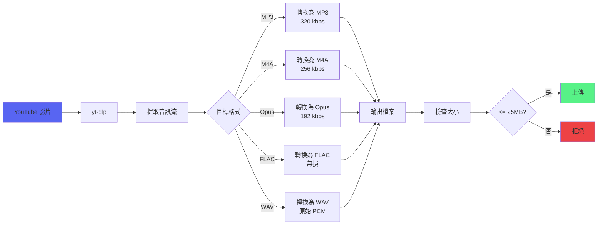
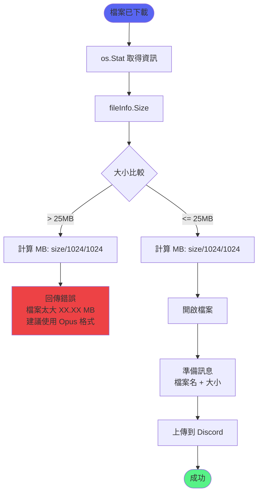
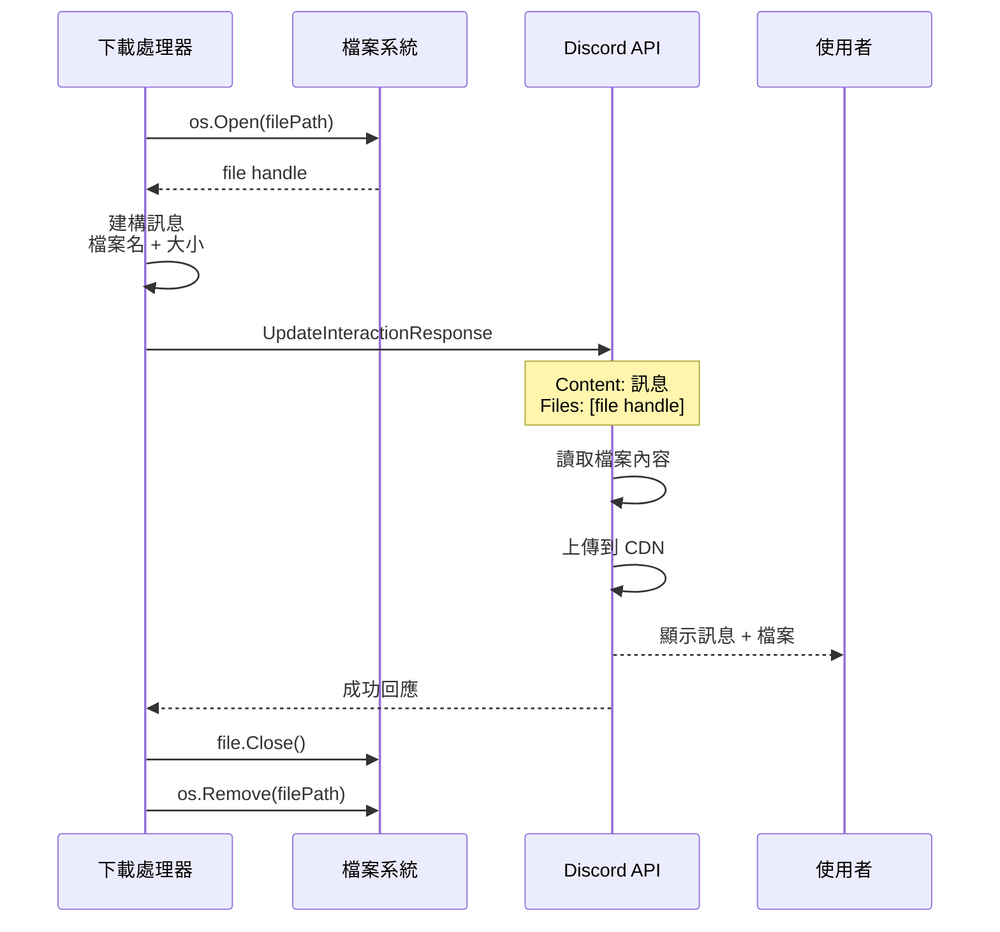
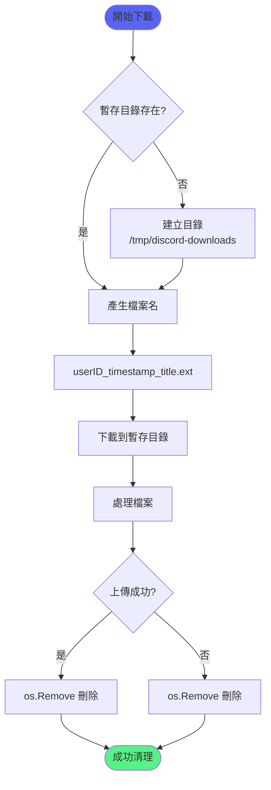
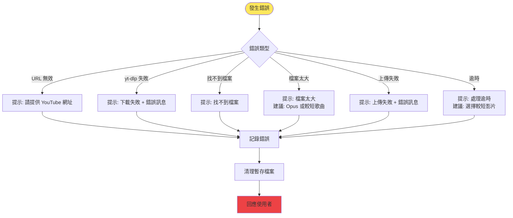
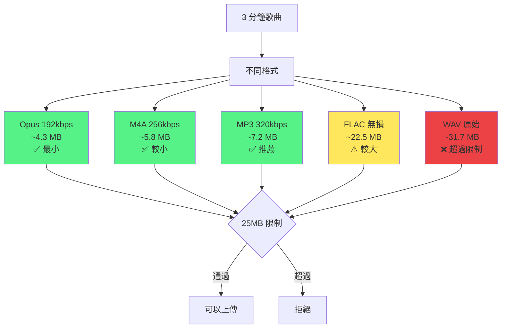
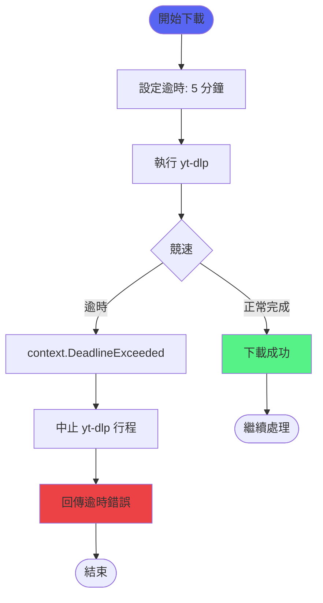

# 下載功能流程

> 從使用者請求到檔案上傳的完整流程

## 完整下載流程

## yt-dlp 參數建構流程

## 格式轉換流程

## 檔案大小檢查流程

## Discord 上傳流程

## 暫存檔案管理

## 錯誤處理決策樹

## 格式大小對比（3 分鐘歌曲）

## 逾時處理流程

## 相關文件

- [下載功能](../功能模組/下載功能.md)
- [音樂播放功能](../功能模組/音樂播放功能.md)
