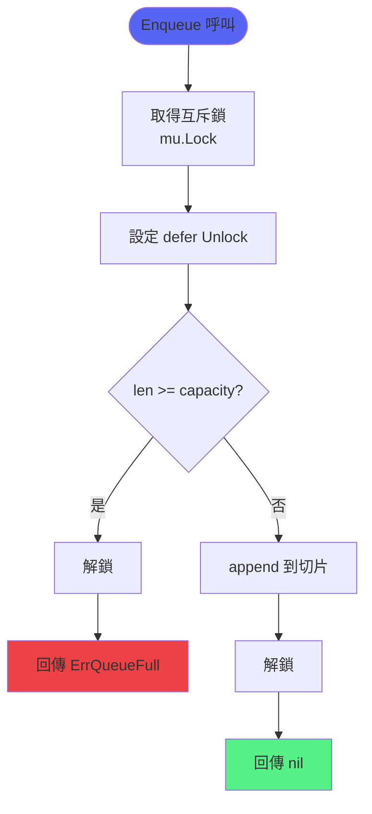
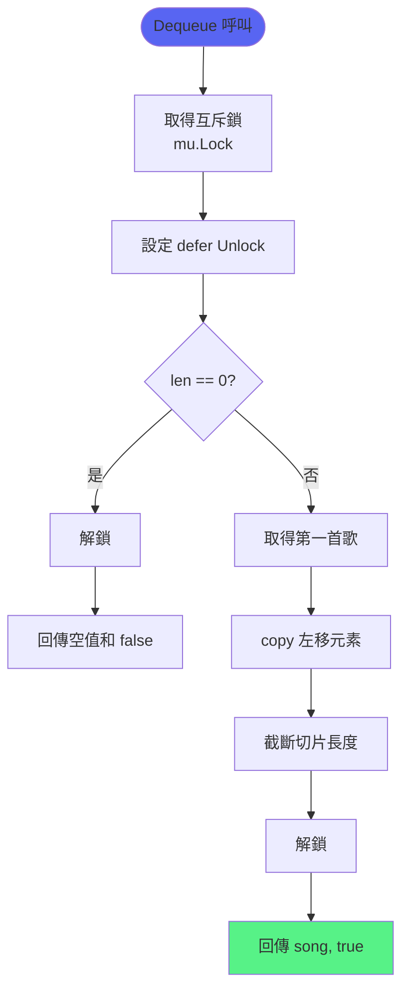
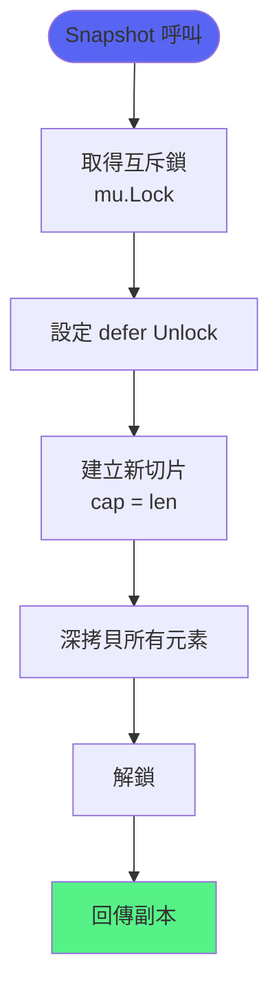
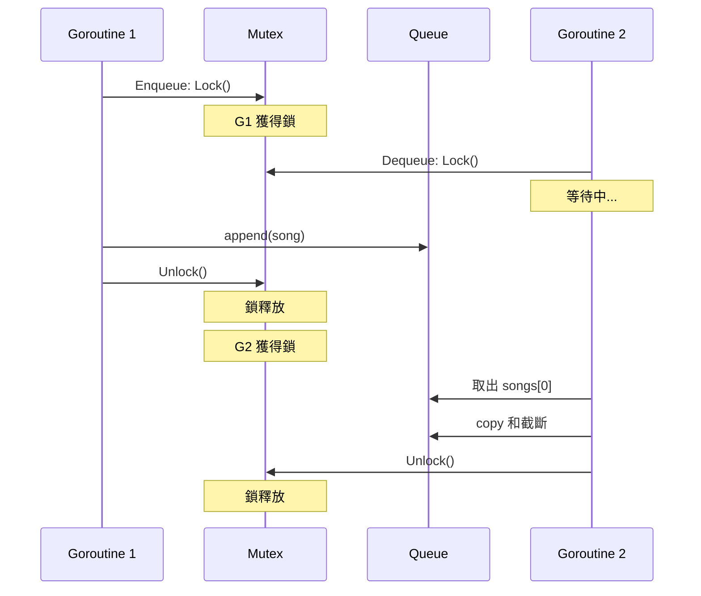
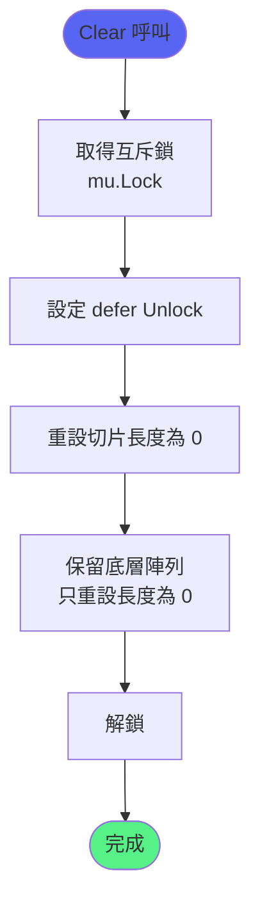
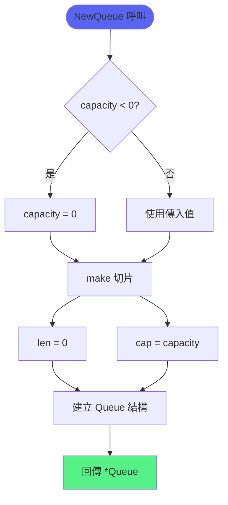
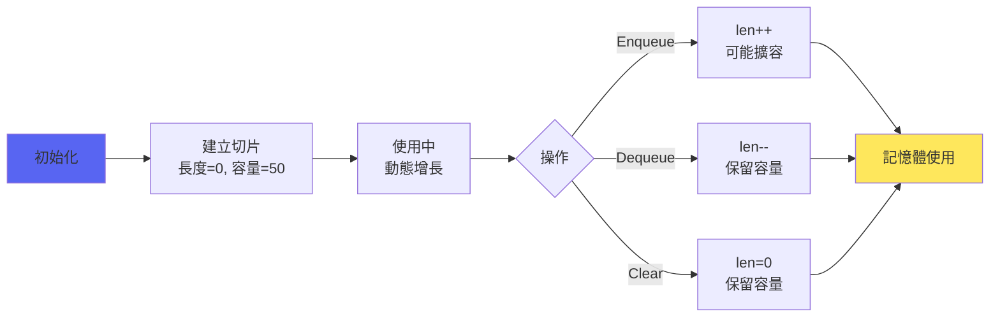
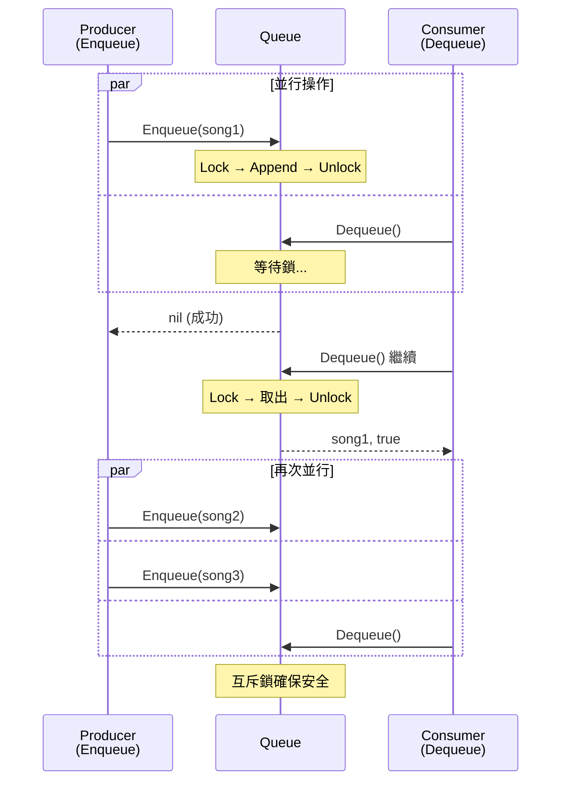
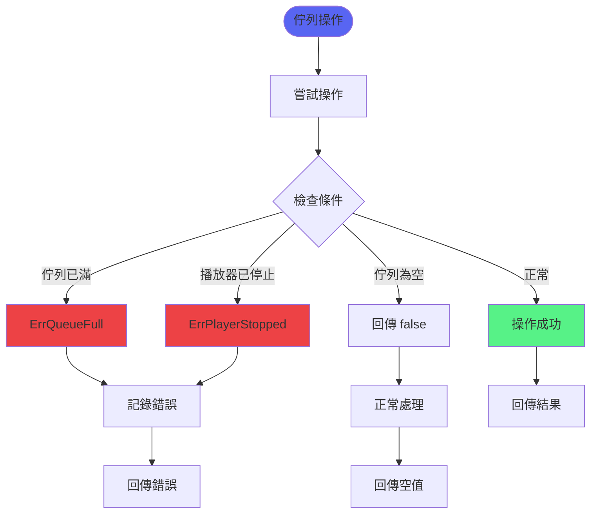
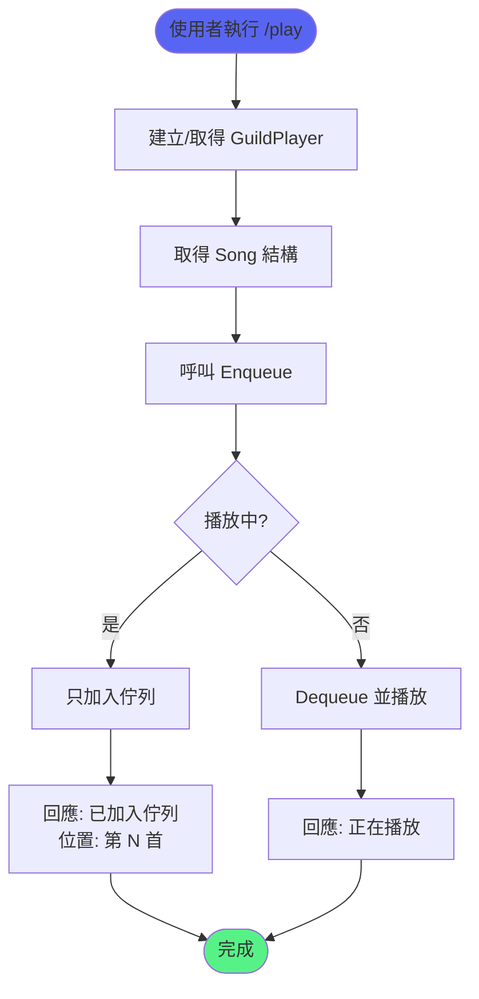

# 佇列管理流程

> 佇列操作的完整流程和並行安全機制

## 佇列入隊流程



## 佇列出隊流程



## 快照功能流程



## 並行安全機制



## GuildPlayer 整合流程

```mermaid
flowchart TD
    Start([播放器操作]) --> Type{操作類型}
    
    Type -->|Enqueue| CheckStopped{播放器已停止?}
    Type -->|Dequeue| DirectDequeue[直接從 Queue 出隊]
    Type -->|QueueSnapshot| DirectSnapshot[直接取得快照]
    
    CheckStopped -->|是| ReturnError[回傳 ErrPlayerStopped]
    CheckStopped -->|否| CallEnqueue[呼叫 queue.Enqueue]
    
    CallEnqueue --> CheckFull{佇列已滿?}
    CheckFull -->|是| ReturnFull[回傳 ErrQueueFull]
    CheckFull -->|否| Success1[加入成功]
    
    DirectDequeue --> GetSong[取得歌曲]
    GetSong --> CheckEmpty{佇列為空?}
    CheckEmpty -->|是| ReturnEmpty[回傳 Song{}, false]
    CheckEmpty -->|否| Success2[回傳 song, true]
    
    DirectSnapshot --> Success3[回傳副本]
    
    Success1 --> End([完成])
    Success2 --> End
    Success3 --> End
    
    style Start fill:#5865F2
    style End fill:#57F287
    style ReturnError fill:#ED4245
    style ReturnFull fill:#ED4245
```

## 佇列清空流程



## 容量管理流程



## 佇列狀態檢查流程

```mermaid
flowchart TD
    Start([Len 呼叫]) --> Lock[取得讀鎖<br/>mu.Lock]
    Lock --> DeferUnlock[設定 defer Unlock]
    
    DeferUnlock --> GetLen[取得 len(songs)]
    GetLen --> Unlock[解鎖]
    
    Unlock --> Return[回傳長度]
    
    style Start fill:#5865F2
    style Return fill:#57F287
```

## 記憶體管理



## 並行場景示例



## 效能特性

```mermaid
graph TD
    A[佇列操作] --> B[時間複雜度]
    
    B --> C[Enqueue<br/>O(1)*]
    B --> D[Dequeue<br/>O(n)]
    B --> E[Snapshot<br/>O(n)]
    B --> F[Len<br/>O(1)]
    B --> G[Clear<br/>O(1)]
    
    C --> H[摊銷<br/>*切片擴容時 O(n)]
    D --> I[需要左移<br/>所有元素]
    E --> J[需要複製<br/>所有元素]
    
    style A fill:#5865F2
    style C fill:#57F287
    style F fill:#57F287
    style G fill:#57F287
```

## 錯誤處理流程



## 使用範例流程



## 相關文件

- [佇列管理功能](../功能模組/佇列管理功能.md)
- [音樂播放功能](../功能模組/音樂播放功能.md)
- [自動播放下一首流程](自動播放下一首流程.md)
