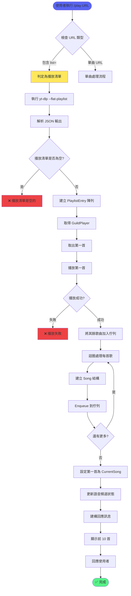
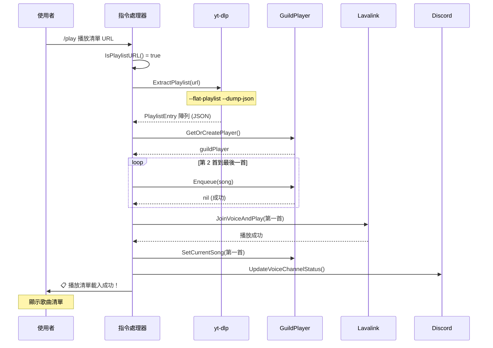
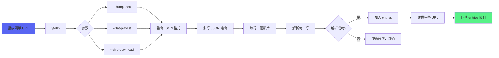
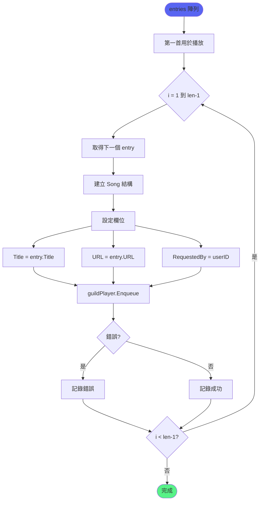
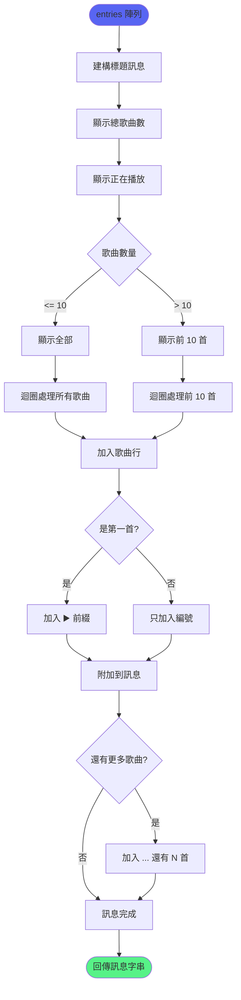
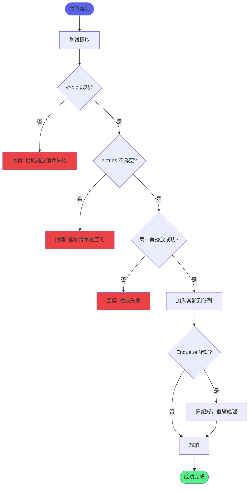
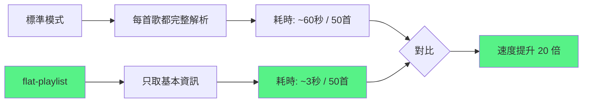

# 播放清單處理流程

> 從檢測 URL 到完成播放的完整流程

## 完整流程圖



## 時序圖



## yt-dlp 執行流程



## 佇列加入流程



## 訊息建構流程



## 訊息範例

```text
📋 播放清單載入成功！

🎵 共 25 首歌曲已加入佇列
▶️ 正在播放：Never Gonna Give You Up

歌曲清單：
▶️ 1. Never Gonna Give You Up
2. Together Forever
3. Whenever You Need Somebody
4. It Would Take a Strong Strong Man
5. The Love Has Gone
6. Don't Say Goodbye
7. Slipping Away
8. No More Looking for Love
9. You Move Me
10. When I Fall in Love

... 還有 15 首歌曲
```

## 錯誤處理流程



## 效能考量



## 相關文件

- [音樂播放功能](../功能模組/音樂播放功能.md)
- [播放清單功能](../功能模組/播放清單功能.md)
- [佇列管理功能](../功能模組/佇列管理功能.md)
