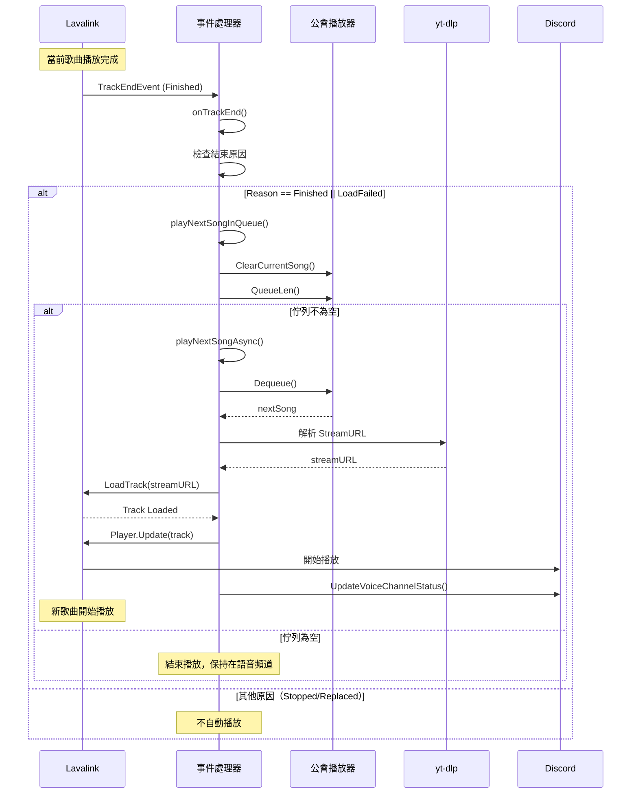
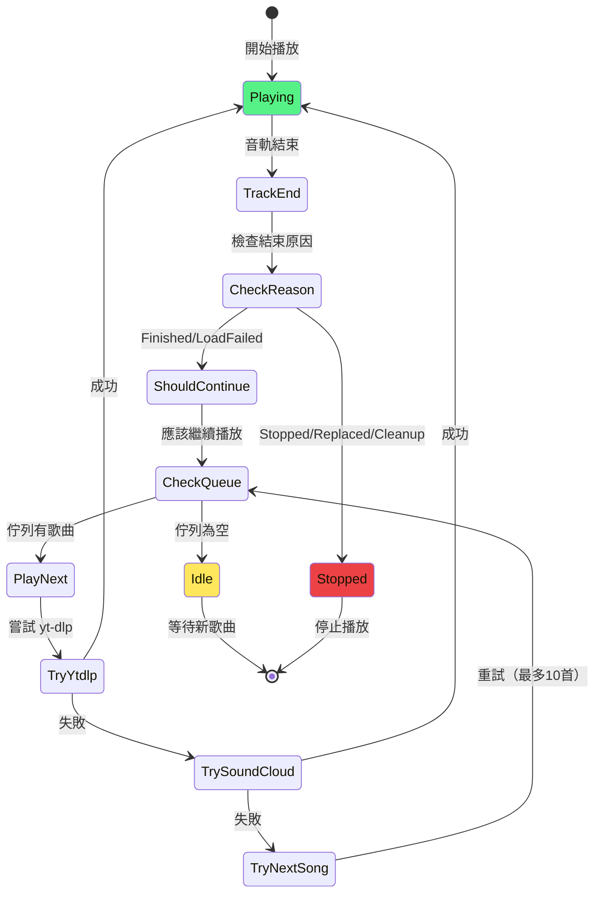
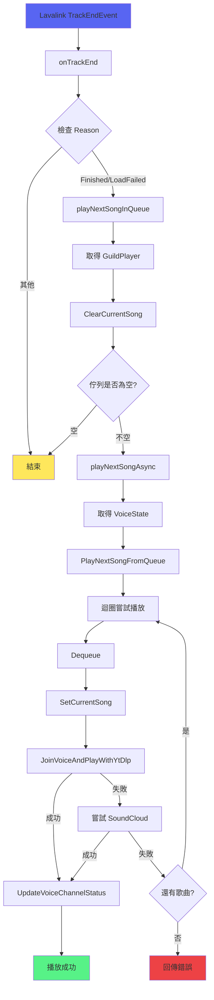
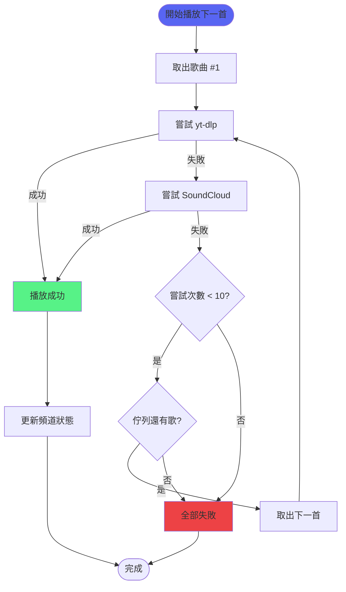

# 自動播放下一首流程

> 詳細說明音軌結束後自動播放下一首的完整流程
> 涉及檔案：`internal/bot/lavalink_handlers.go`, `internal/command/voice.go`

## 概述

自動播放下一首是音樂機器人的核心功能，確保佇列中的歌曲能夠連續播放，無需使用者手動干預。

## 完整流程圖



## 狀態機圖



## 核心函式調用鏈



## 詳細步驟

### 1. 觸發事件

**位置**：Lavalink Server

當音軌播放結束時，Lavalink 發送 `TrackEndEvent`：

```json
{
  "op": "event",
  "type": "TrackEndEvent",
  "guildId": "123456789",
  "track": {
    "info": {
      "title": "Never Gonna Give You Up",
      "author": "Rick Astley"
    }
  },
  "reason": "finished"
}
```

---

### 2. 事件接收

**位置**：`internal/bot/lavalink_handlers.go:18`

```go
func (l *BotEventListener) OnEvent(player disgolink.Player, event lavalink.Message) {
    switch e := event.(type) {
    case lavalink.TrackEndEvent:
        l.bot.onTrackEnd(player, e)  // 呼叫事件處理器
    }
}
```

---

### 3. 判斷是否繼續播放

**位置**：`internal/bot/lavalink_handlers.go:39`

```go
func (b *Bot) onTrackEnd(player disgolink.Player, event lavalink.TrackEndEvent) {
    log.Printf("[Lavalink] Track ended: %s (reason: %s)", 
        event.Track.Info.Title, event.Reason)

    // 只處理 Finished 和 LoadFailed
    shouldPlayNext := event.Reason == lavalink.TrackEndReasonFinished || 
                      event.Reason == lavalink.TrackEndReasonLoadFailed

    if !shouldPlayNext {
        return  // 其他原因不自動播放
    }

    b.playNextSongInQueue(player)
}
```

**決策表**：

| Reason | 說明 | 自動播放 | 場景 |
|--------|------|---------|------|
| Finished | 正常播放完成 | ✅ | 歌曲播放到結尾 |
| LoadFailed | 載入失敗 | ✅ | 影片無法播放、版權限制 |
| Stopped | 手動停止 | ❌ | 使用者執行 /stop |
| Replaced | 被取代 | ❌ | 播放新歌曲 |
| Cleanup | 清理 | ❌ | Bot 斷線 |

---

### 4. 檢查佇列狀態

**位置**：`internal/bot/lavalink_handlers.go:60`

```go
func (b *Bot) playNextSongInQueue(player disgolink.Player) {
    guildIDStr := player.GuildID().String()
    
    // 取得播放器
    guildPlayer, ok := b.playerManager.Get(guildIDStr)
    if !ok || guildPlayer == nil {
        log.Printf("[Lavalink] No player found")
        return
    }

    // 清除當前歌曲
    guildPlayer.ClearCurrentSong()

    // 檢查佇列
    if guildPlayer.QueueLen() == 0 {
        log.Printf("[Lavalink] No more songs in queue")
        return  // 佇列為空，結束
    }

    // 播放下一首
    go b.playNextSongAsync(player)
}
```

---

### 5. 播放下一首（帶重試）

**位置**：`internal/command/voice.go:178`

```go
func PlayNextSongFromQueue(client, guildID, channelID) (*player.Song, error) {
    guildPlayer := musicService.GetOrCreatePlayer(guildID.String())

    // 最多嘗試 10 首歌曲
    maxAttempts := 10
    for attempt := 0; attempt < maxAttempts && guildPlayer.QueueLen() > 0; attempt++ {
        // 1. 取出下一首
        nextSong, ok := guildPlayer.Dequeue()
        if !ok {
            return nil, fmt.Errorf("no songs in queue")
        }

        log.Printf("[AutoPlay] Attempting: %s (attempt %d)", nextSong.Title, attempt+1)
        guildPlayer.SetCurrentSong(nextSong)

        // 2. 嘗試 yt-dlp
        err := JoinVoiceAndPlayWithYtDlp(client, guildID, channelID, nextSong.URL)
        if err == nil {
            log.Printf("[AutoPlay] Success: %s", nextSong.Title)
            go UpdateVoiceChannelStatus(client, channelID, nextSong.Title)
            return &nextSong, nil
        }

        log.Printf("[AutoPlay] yt-dlp failed: %v, trying SoundCloud...", err)

        // 3. 嘗試 SoundCloud 備用
        searchQuery := "scsearch:" + nextSong.Title
        err = JoinVoiceAndPlay(client, guildID, channelID, searchQuery)
        if err == nil {
            log.Printf("[AutoPlay] SoundCloud success: %s", nextSong.Title)
            go UpdateVoiceChannelStatus(client, channelID, nextSong.Title)
            return &nextSong, nil
        }

        log.Printf("[AutoPlay] SoundCloud failed: %v, trying next...", err)
        guildPlayer.ClearCurrentSong()
    }

    return nil, fmt.Errorf("failed to play any song after %d attempts", maxAttempts)
}
```

---

## 重試機制

### 重試流程圖



### 重試策略

1. **最多嘗試 10 首歌曲**
   - 防止無限迴圈
   - 覆蓋大部分失敗場景

2. **雙重備用方案**
   - 主方案：yt-dlp（直接提取）
   - 備用方案：SoundCloud 搜尋

3. **失敗自動跳過**
   - 無法播放的歌曲自動跳過
   - 不影響後續歌曲播放

---

## 日誌輸出

### 正常流程日誌

```
[Lavalink] Track ended for guild 123456789: Song A (reason: finished)
[Lavalink] Attempting to play next song...
[AutoPlay] Attempting to play: Song B (attempt 1)
[AutoPlay] Successfully playing: Song B
[VoiceChannel] Updated channel status: 🎵 Song B
[Lavalink] Track started for guild 123456789: Song B
```

### 重試流程日誌

```
[Lavalink] Track ended for guild 123456789: Song A (reason: finished)
[AutoPlay] Attempting to play: Song B (attempt 1)
[AutoPlay] Failed to play Song B: video unavailable, trying SoundCloud...
[AutoPlay] SoundCloud also failed for Song B: no matches, trying next song...
[AutoPlay] Attempting to play: Song C (attempt 2)
[AutoPlay] Successfully playing: Song C
```

---

## 相關文件

- [Lavalink整合](../功能模組/Lavalink整合.md) - Lavalink 事件處理
- [播放控制功能](../功能模組/播放控制功能.md) - 播放控制
- [佇列管理功能](../功能模組/佇列管理功能.md) - 佇列操作
- [音樂播放功能](../功能模組/音樂播放功能.md) - 播放功能
