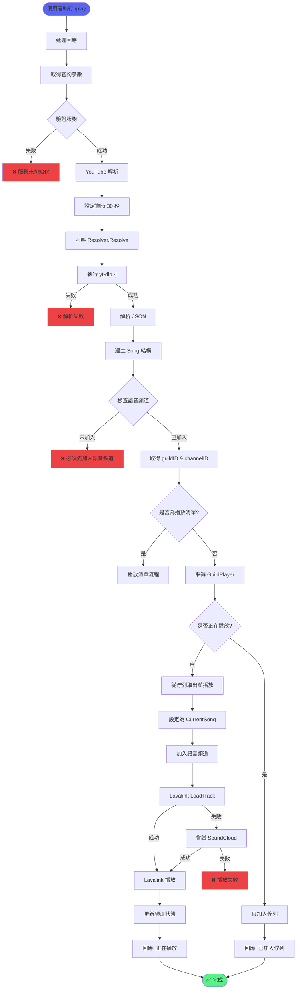
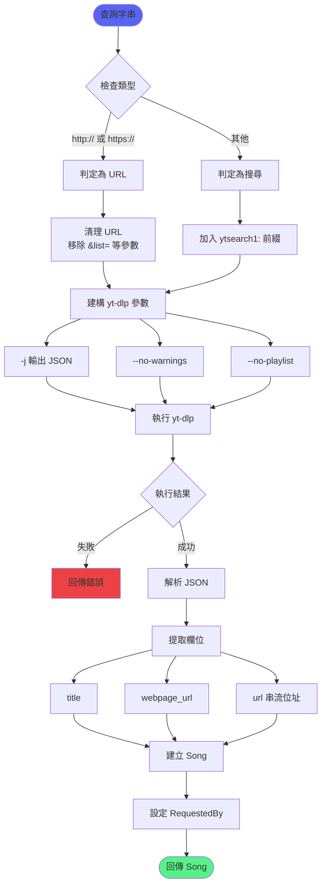
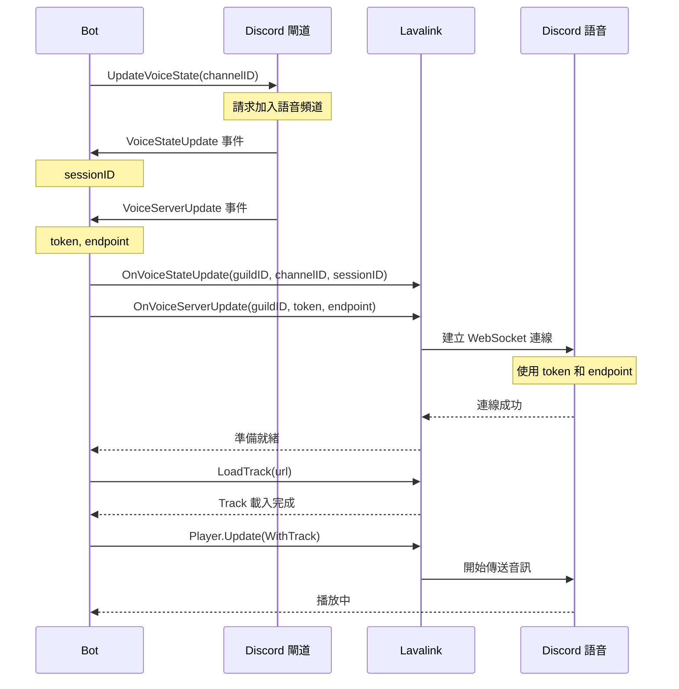
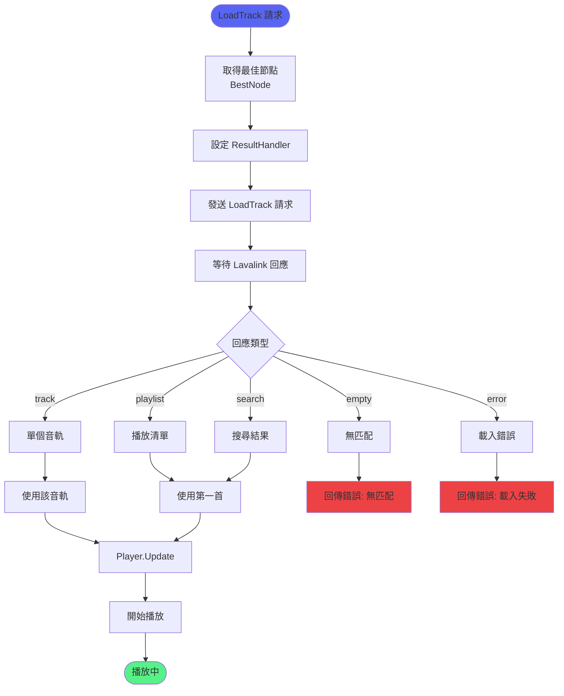
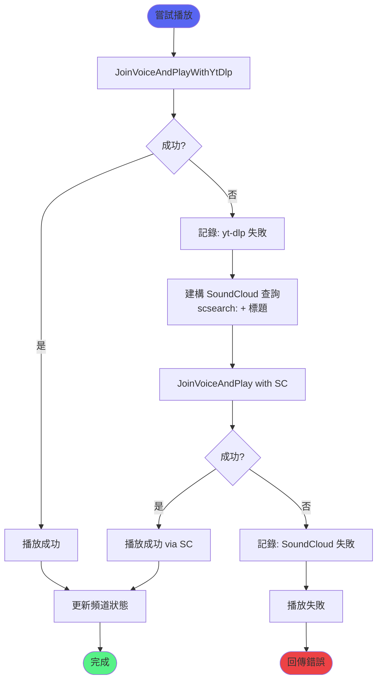
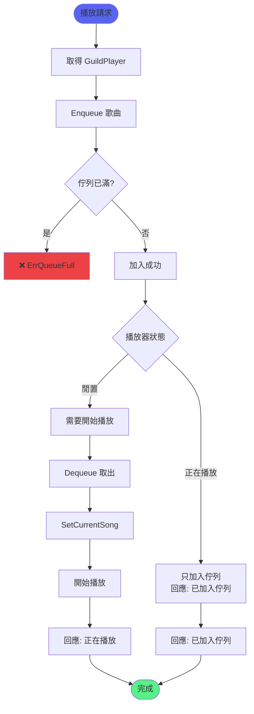
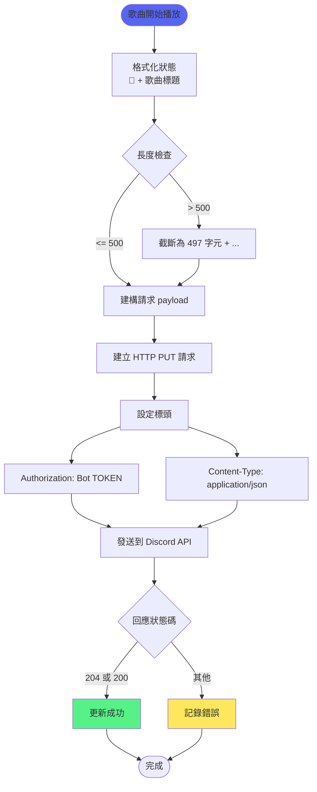
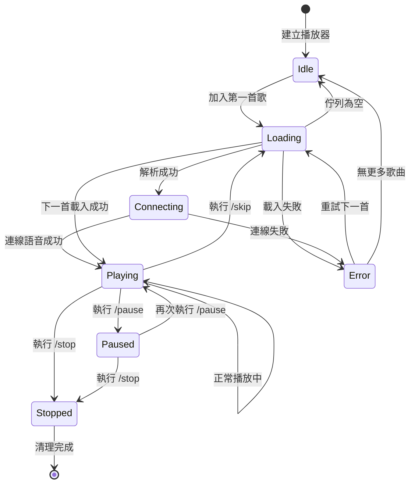
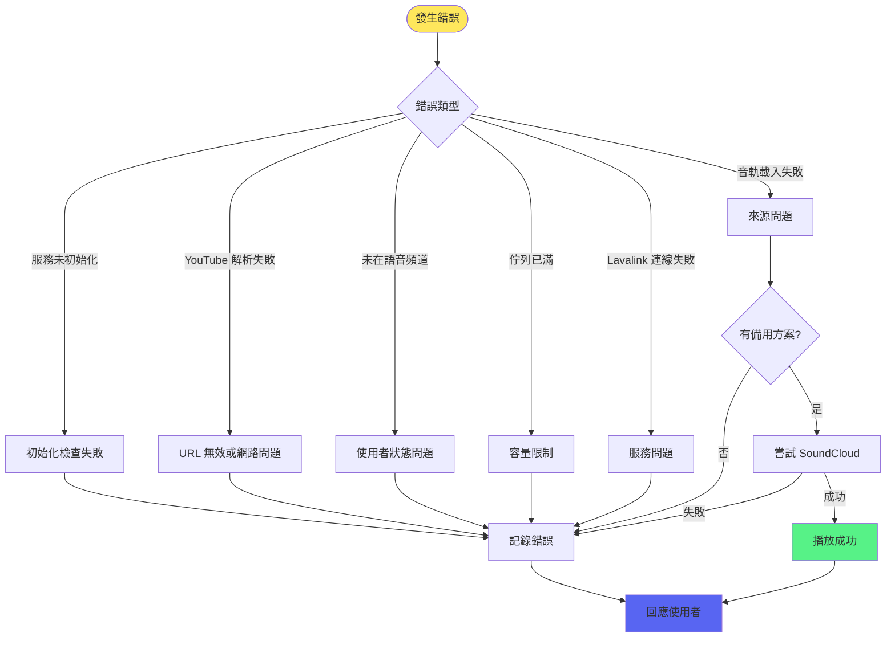

# 音樂播放完整流程

> 從使用者執行指令到音樂開始播放的完整流程

## 播放指令完整流程

## YouTube 解析流程

## 語音連接流程

## Lavalink LoadTrack 流程

## 播放失敗備用流程

## 佇列處理邏輯

## 頻道狀態更新流程

## 播放器狀態機

## 錯誤處理決策

## 相關文件

- [音樂播放功能](../功能模組/音樂播放功能.md)
- [佇列管理功能](../功能模組/佇列管理功能.md)
- [Lavalink整合](../功能模組/Lavalink整合.md)
