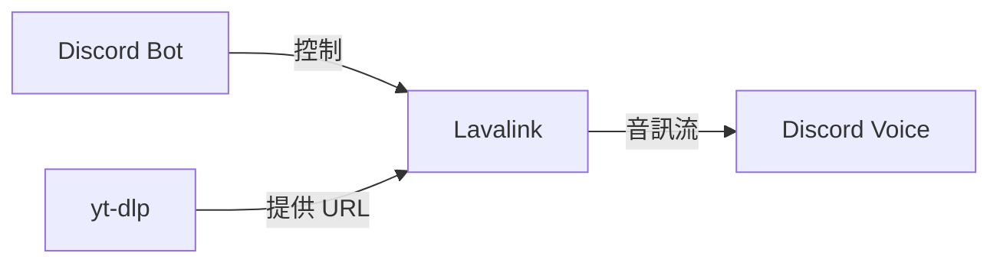

# 專有名詞索引

> 技術術語、概念和縮寫的詳細解釋
> 更新時間：2026-06-21

## D

### Defer Response
延遲回應機制。Discord 要求 Bot 在 3 秒內回應互動，使用 `DeferCreateMessage()` 可以延長到 15 分鐘。

**程式碼範例**：
```go
if err := event.DeferCreateMessage(false); err != nil {
    log.Printf("failed to defer response: %v", err)
    return
}
```

### disgo
Go 語言的 Discord API 函式庫，提供完整的 Discord Bot 功能。

**官方文件**：https://github.com/disgoorg/disgo

### disgolink
disgo 的 Lavalink 客戶端實作，用於音訊播放。

**版本**：v3
**官方文件**：https://github.com/disgoorg/disgolink

---

## E

### Embed
Discord 嵌入訊息，支援富文字格式、顏色、欄位等。

**範例**：
```go
embed := discord.NewEmbedBuilder().
    SetTitle("🎵 正在播放").
    SetDescription("Never Gonna Give You Up").
    SetColor(0x5865F2).
    Build()
```

---

## F

### FIFO (First In First Out)
先進先出佇列，播放佇列使用此策略。

**實作**：見[佇列管理功能](../功能模組/佇列管理功能.md)

---

## G

### Guild
Discord 伺服器。每個伺服器有獨立的播放器實例。

### GuildID
Discord 伺服器的唯一識別碼，類型為 `snowflake.ID`。

### GuildPlayer
單個 Discord 伺服器的播放器實例，管理該伺服器的播放狀態和佇列。

**位置**：`internal/player/player.go`

---

## L

### Lavalink
獨立的音訊播放伺服器，處理音訊流的解碼和播放。

**架構**：


**設定**：
```yaml
Address: lavalink:2333
Password: youshallnotpass
```

**相關**：[Lavalink整合](../功能模組/Lavalink整合.md)

---

## M

### Mutex (sync.Mutex)
互斥鎖，用於保護並行存取的共享資源。

**使用場景**：
- 佇列操作
- 播放器狀態

**程式碼範例**：
```go
func (q *Queue) Enqueue(song Song) error {
    q.mu.Lock()           // 加鎖
    defer q.mu.Unlock()   // 延遲解鎖
    
    // 臨界區程式碼
    q.songs = append(q.songs, song)
    return nil
}
```

---

## O

### Opus
音訊編碼格式，Discord 語音使用 Opus 編碼。

**特點**：
- 低延遲
- 高壓縮率
- 適合即時語音

---

## Q

### Queue (佇列)
FIFO 佇列，儲存待播放的歌曲。

**操作**：
- `Enqueue` - 入隊
- `Dequeue` - 出隊
- `Snapshot` - 取得快照
- `Clear` - 清空

**相關**：[佇列管理功能](../功能模組/佇列管理功能.md)

---

## R

### Resolver
解析器介面，將 YouTube URL 或搜尋關鍵字解析為可播放的歌曲資訊。

**實作**：`ytdlpResolver`
**位置**：`internal/youtube/resolver.go`

**介面定義**：
```go
type Resolver interface {
    Resolve(ctx context.Context, query string) (player.Song, error)
}
```

### RWMutex (sync.RWMutex)
讀寫鎖，允許多個讀者或一個寫者。

**優勢**：讀操作不互斥，提高並行效能

**使用**：
```go
// 讀操作
func (p *GuildPlayer) IsPaused() bool {
    p.mu.RLock()
    defer p.mu.RUnlock()
    return p.paused
}

// 寫操作
func (p *GuildPlayer) TogglePause() bool {
    p.mu.Lock()
    defer p.mu.Unlock()
    p.paused = !p.paused
    return p.paused
}
```

---

## S

### Slash Command
Discord 斜線指令，以 `/` 開頭的指令。

**範例**：`/play`, `/pause`, `/skip`

### Snowflake ID
Discord 使用的 64 位元唯一識別碼。

**組成**：
- 時間戳記（毫秒）
- 工作行程 ID
- 序列號

**類型**：`snowflake.ID`

### Song
歌曲資料結構，包含標題、URL 和請求者資訊。

**定義**：
```go
type Song struct {
    Title       string // 歌曲標題
    URL         string // 原始 URL
    StreamURL   string // 串流媒體 URL
    RequestedBy string // 請求者 ID
}
```

**位置**：`internal/player/song.go`

### StreamURL
串流媒體播放 URL，由 yt-dlp 提取的實際音訊流位址。

**與 URL 的區別**：
- `URL` - YouTube 影片頁面 URL
- `StreamURL` - 直接可播放的音訊流 URL

---

## T

### TrackEndEvent
Lavalink 音軌結束事件，觸發自動播放下一首。

**結束原因**：
- `TrackEndReasonFinished` - 正常播放完成
- `TrackEndReasonLoadFailed` - 載入失敗
- `TrackEndReasonStopped` - 手動停止
- `TrackEndReasonReplaced` - 被新音軌取代
- `TrackEndReasonCleanup` - 清理

**處理**：
```go
func (b *Bot) onTrackEnd(player disgolink.Player, event lavalink.TrackEndEvent) {
    if event.Reason == lavalink.TrackEndReasonFinished {
        // 播放下一首
        b.playNextSongInQueue(player)
    }
}
```

**相關**：[Lavalink整合](../功能模組/Lavalink整合.md)

---

## Y

### yt-dlp
命令列工具，用於下載和提取 YouTube 影片資訊。

**功能**：
- 提取影片詮釋資料
- 取得音訊流 URL
- 下載和轉換音訊
- 播放清單解析

**常用參數**：
```bash
yt-dlp -j                    # 輸出 JSON
yt-dlp -f bestaudio          # 最佳音質
yt-dlp --flat-playlist       # 快速提取播放清單
yt-dlp --extract-audio       # 只提取音訊
yt-dlp --audio-format mp3    # 轉換為 MP3
```

**官方文件**：https://github.com/yt-dlp/yt-dlp

---

## 縮寫對照表

| 縮寫 | 全稱 | 說明 |
|------|------|------|
| API | Application Programming Interface | 應用程式介面 |
| FIFO | First In First Out | 先進先出 |
| JSON | JavaScript Object Notation | JavaScript 物件表示法 |
| MB | Megabyte | 百萬位元組 |
| MP3 | MPEG Audio Layer 3 | 音訊編碼格式 |
| REST | Representational State Transfer | 表現層狀態轉換 |
| URL | Uniform Resource Locator | 統一資源定位符 |
| WAV | Waveform Audio File Format | 波形音訊檔案格式 |

---

## Discord 術語

| 術語 | 說明 |
|------|------|
| Guild | 伺服器 |
| Channel | 頻道 |
| Voice Channel | 語音頻道 |
| Text Channel | 文字頻道 |
| Embed | 嵌入訊息（富文字） |
| Component | 元件（按鈕、選單等） |
| Interaction | 互動（指令、按鈕點擊等） |
| Token | Bot 令牌 |

---

## Go 並行術語

| 術語 | 說明 |
|------|------|
| Goroutine | Go 協程 |
| Channel | 通道（用於 goroutine 通訊） |
| Mutex | 互斥鎖 |
| RWMutex | 讀寫鎖 |
| sync.Once | 只執行一次的機制 |
| Context | 上下文（逾時、取消控制） |

---

## 相關文件

- [INDEX](../INDEX.md) - 主索引
- [音樂播放功能](../功能模組/音樂播放功能.md)
- [佇列管理功能](../功能模組/佇列管理功能.md)
